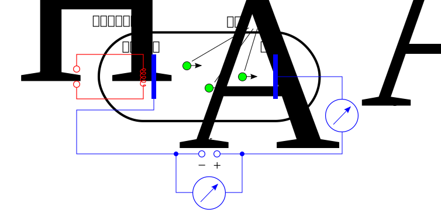
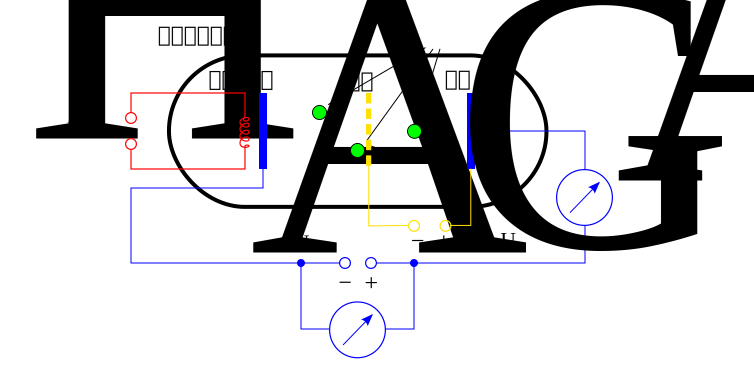

# 电子元件

[电子元件](https://zh.wikipedia.org/zh-cn/%E9%9B%BB%E5%AD%90%E5%85%83%E4%BB%B6)（electronic component）又称电子组件、电子器件和电路元件，是电子电路中的基本元素，通常是个别封装，并具有两个或以上的引线或金属触点。电子元件须相互连接以构成一个具有特定功能的电子电路，例如：[放大器](https://zh.wikipedia.org/wiki/放大器)、[无线电接收机](https://zh.wikipedia.org/wiki/无线电接收机)、[振荡器](https://zh.wikipedia.org/wiki/振盪器)等；而连接电子元件常见的方式之一是[焊接](https://zh.wikipedia.org/wiki/焊接)到[印刷电路板](https://zh.wikipedia.org/wiki/印刷電路板)上。

电子元件也许是单独的封装，称为[离散元件](https://zh.wikipedia.org/wiki/離散元件)（[电阻器](https://zh.wikipedia.org/wiki/電阻器)、[电容器](https://zh.wikipedia.org/wiki/電容器)、[电感器](https://zh.wikipedia.org/wiki/電感器)、[晶体管](https://zh.wikipedia.org/wiki/晶體管)、[二极管](https://zh.wikipedia.org/wiki/二極管)等）；或是将多重电子元件与电路以集中且小型化的方式，制造在半导体晶圆表面上，形成各种不同复杂度的群组，称为[集成电路](https://zh.wikipedia.org/wiki/積體電路)（[运算放大器](https://zh.wikipedia.org/wiki/運算放大器)、[排阻](https://zh.wikipedia.org/w/index.php?title=排阻&action=edit&redlink=1)、[逻辑门](https://zh.wikipedia.org/wiki/邏輯閘)等）。

# 真空管

**真空管**（Vacuum Tube）是一种在电路中控制电子流动的电子元件。参与工作的电极被封装在一个真空的容器内（管壁大多为玻璃）。

在[二十世纪](https://zh.wikipedia.org/wiki/二十世紀)中期前，因[半导体](https://zh.wikipedia.org/wiki/半導體)尚未普及，基本上当时所有的电子器材都使用真空管，形成了当时对真空管的需求。但在[半导体](https://zh.wikipedia.org/wiki/半導體)技术的发展普及和平民化下，真空管因成本高、不耐用、体积大、效能低等原因，最后被半导体取代了。但是可以在[音响](https://zh.wikipedia.org/wiki/音響)扩大机、[微波炉](https://zh.wikipedia.org/wiki/微波爐)及[人造卫星](https://zh.wikipedia.org/wiki/人造衛星)的[高频发射机](https://zh.wikipedia.org/wiki/发送器)看见真空管的身影；许多音响特别使用真空管是因为其特殊音质，在音响界、老旧的真空管常与最新的数位 [IC](https://zh.wikipedia.org/wiki/集成电路) 共存。另外，像是[电视机](https://zh.wikipedia.org/wiki/電視機)与[电脑](https://zh.wikipedia.org/wiki/電腦)[阴极射线管](https://zh.wikipedia.org/wiki/陰極射線管)显示器内的阴极射线管以及 [X 光机](https://zh.wikipedia.org/wiki/X光机)的 [X 射线管](https://zh.wikipedia.org/wiki/X射线管)等则是属于特殊的真空管。

对于大功率放大（如百万瓦电台）及卫星（微波大功率）而言，大功率真空管及[行波管](https://zh.wikipedia.org/wiki/行波管)仍是唯一的选择。对于高频[电焊机](https://zh.wikipedia.org/wiki/焊接)及X射线机，它仍是主流器件。

## 历史

真空管的历史可溯自改良[灯泡](https://zh.wikipedia.org/wiki/燈泡)的商人[托马斯·爱迪生](https://zh.wikipedia.org/wiki/湯瑪斯·愛迪生)。1880年某日，他好奇地在灯泡中多放了一个电极，且洒了点箔片，结果发现了奇特的现象：第三极通正电时，箔片毫无反应；但通负电时，箔片随即翻腾漂浮。当时爱迪生不知道此现象的起由，但由于他不经意的发现，这个现象后来被称为[爱迪生效应](https://zh.wikipedia.org/wiki/爱迪生效应)。一直到1901年，[欧文·理查德森](https://zh.wikipedia.org/wiki/欧文·理查森)提出定律，说明电子的[激发态](https://zh.wikipedia.org/wiki/激發態)引起箔片漂浮，后更以此拿到1928年的[诺贝尔物理奖](https://zh.wikipedia.org/wiki/諾貝爾物理獎)。接着[约翰·弗莱明](https://zh.wikipedia.org/wiki/約翰·弗萊明)在1904年发展出[二极管](https://zh.wikipedia.org/wiki/二極管)，[李·德佛瑞斯特](https://zh.wikipedia.org/wiki/李·德佛瑞斯特)更在1907年作出第一个[三极管](https://zh.wikipedia.org/wiki/三极管_(真空管))。

## 真空二极管

如图所示：

1. 将加热电压施加于真空二极管的灯丝之上，将阴极加热至红热，从而使阴极的电子被激发（因此灯丝和阴极发出红光）。
2. 相较于阳极，阴极有更多的电子处于较高能量的激发态。因此，电子更容易被从阴极发射。
3. 当阴极接在电源的负极，阳极接在电源的正极时，两极间的电势差形成电场，使得阴极的电子跳跃至阳极。与之相反，若电势差的方向逆转，电子无法轻易的离开阳极跳跃至阴极。
4. 移动的电子形成电流，因为电子只能从阴极移至阳极，所以工作中的真空二极管具有单向导电性。

## 真空三极管

在真空二极管的基础上，三极管在阴极和阳极之间添加了一个栅极。通过在栅极和阳极间加上栅极电压，可以使栅极带上负电荷。由于电荷的同性相斥，通过改变栅极电场的强度，就可以改变电子通过栅极的流量，从而起到放大作用。

## 抽真空

电子在于其放射过程中，因会与空气中之组成分子相撞而产生阻力，因此电子经由如空气之类的介质来移动的话，将会比在真空状态来的困难，所以若想轻松的达成电子放射之移动过程，需将产生电子放射及电子收集之各项元件，也就是灯丝、阴极、栅极、屏极等封装于玻璃管内，且将其内部成为真空状态，才能使电子之放射动作达成最高效率。若然真空度不足，会因为被阴极射出的电子击打管中的空气，令空气的原子被激发至激态发出红光，并严重影响真空管之工作表现。另一方面电子打到玻璃也会产生蓝光并产生二次电子反射噪音。

# 半导体二极管

硅本身并不具有导电能力，通常是参杂其它材料以获得导电性。硅与硼结合会有一个电子**空洞**，称为 P 型材料，硅与锑结合则会多出一个自由电子，称为 N 型材料，二极管由 P 和 N 型材料组成。

将 N 型材料与 P 型材料融合在一起时，N 型材料中的部分自由电子会迁移到 P 型材料的空洞中形成一堵墙，称为 PN 结。

当 P 连接电源的正极，N 连接电源的负极时，NP 材料中的自由电子向着电源的正极移动，也就产生了电流。如果反转二极管，P 连接负极，N 连接正极，由于 PN 结的存在，没有空洞可以让电子通过，因此不会形成电流。这种现象称为**单向导电性**。

由于二极管的单向导电性，它经常被用在**交流电**转**直流电**的整流电路中。

# 晶体管

[晶体管](https://zh.wikipedia.org/zh-cn/%E6%99%B6%E4%BD%93%E7%AE%A1)（transistor），又称三极管，是一种类似于阀门的固体半导体器件，可以用于放大、开关、稳压、信号调制和许多其他功能。在1947年，由[约翰·巴丁](https://zh.wikipedia.org/wiki/约翰·巴丁)、[沃尔特·布拉顿](https://zh.wikipedia.org/wiki/沃尔特·布拉顿)和[威廉·肖克利](https://zh.wikipedia.org/wiki/威廉·肖克利)所发明。当时巴丁、布拉顿主要发明半导体三极管；肖克利则是发明 [PN 二极管](https://zh.wikipedia.org/wiki/二極管)，他们因为半导体及晶体管效应的研究获得1956年诺贝尔物理奖。

晶体管由半导体材料组成，至少有三个对外端点称之为极。以双极性接面晶体管为例，有发射极（E）、基极（B）、集电极（C），其中基极（B）是控制极，另外两个端点之间的伏安特性关系是受到控制极的非线性电阻关系。晶体管受控制极输入的电流或电压，改变输出端的阻抗，从而控制通过输出端的电流，因此晶体管可以作为电流开关，而因为晶体管输出信号的功率可以大于输入信号的功率，因此晶体管可以作为电子放大器。

晶体管主要有两种类型：NPN 和 PNP，以 NPN 为例，使用方法如下：

B 极电压高于 E 极电压 0.7v 就可以使 E 极和 C 极形成通路，一般是 E 极接地（0v），集电极接正极，B 极接控制信号。B 极最好连接一个限流电阻，因为 B 极的电流也会流向 E 极，如果没有限流电阻会使得电路中的电流过大。