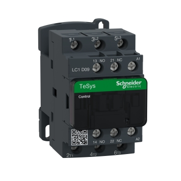

# 电器元件

电路控制系统的基本组成原件。

# 继电器

继电器（Relay），也称电驿，是一种电子控制器件，它具有控制系统（又称输入回路）和被控制系统（又称输出回路），通常应用于自动控制电路中，它实际上是用较小的电流去控制较大电流的一种“自动开关”。 故在电路中起着自动调节、安全保护、转换电路等作用。

## 交流接触器

接触器（Contactor），指利用线圈流过电流产生磁场，使触头闭合，以达到控制负载的电器。因为可快速切断交流与直流主回路和可频繁地接通与大电流控制（某些型别可达800安培）电路的装置，所以经常运用于电动机做为控制对象，也可用作控制工厂设备、电热器、工作母机和各样电力机组等电力负载，并作为远距离控制装置。

以施耐德电气的 [LC1D09M7C](https://www.schneider-electric.cn/zh/product/LC1D09M7C/tesys-deca%E6%8E%A5%E8%A7%A6%E5%99%A83%E6%9E%813noac3-ac3e440v9a220vac%E8%9E%BA%E9%92%89%E7%AB%AF%E5%AD%90/) 为例：

L1、L2、L3、T1、T2 和 T3 为主触点，为常闭触点，L1、L2 和 L3 接电源，T1、T2 和 T3 接被控电器（如电机）。

NO 和 NC 为辅助触点，NO 为常开触点，NC 为常闭触点。

A1 和 A2 接控制电路。

A1 和 A2 得电，NO 和主触点闭合，NC 断开，A1 和 A2 失电，NO 和主触点断开，NC 闭合。