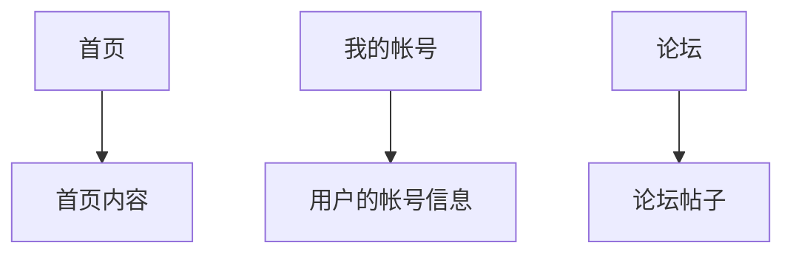

# VUE 路由（router）

## 简介

### 前端路由

前端的路由概念源自互联网的路由，与互联网中的路由不同的是，互联网中的路由指的是 NAT 协议中的 IP 和 MAC 的关系映射，而前端路由则是 URL 和静态资源的映射。

 html、css、js 都打包在一个 js 文档当中，这样不需要进行多次网络请求，就可以直接获得大部分的网页所需的静态资源，前端的诞生就是为了从这些被整合到一起的资源，获得指定的资源。最能提现前端路由作用的，就是分页选项卡。

举个例子，假设一个网站需要有首页、我的帐号、论坛这三个页面，结构示意图如下：



前端路由的目的就是在不进行网络请求的情况下，改变页面的内容，用户要看首页，就展示首页，用户要看伦天，就展示论坛，这种方式有个名称叫做“单页面复用”。

前端路由的使用有三种方式：<font style="background-color: yellowgreen">location.hash、history.pushState()、history.replaceState()</font>，以网站 [https://www.example.com/](https://www.example.com/) 为例，详细说明如下：

**location.hash：**

本质上是在当前的url末尾追加一个锚点，在浏览器输入以下代码：

```javascript
location.hash = "demo"
```

浏览器中原本的 https://www.example.com/ 会被更改为 https://www.example.com/#demo。

与 location.hash 相对的是 location.href，location.href 会向服务器请求静态资源。

**history.pushState()：**

该函数与 location.hash 不同的地方在于 location.hash 是在 url 末尾追加锚点，而 history.pushState() 函数则是直接修改 URL 的 PATH 部分，并且在浏览器的历史记录当中添加一条浏览记录，除了没有真正发送网络请求之外，与真的从服务器请求一个新的页面无异。火狐浏览器函数的声明是 `history.pushState(state, title[, url])`，chrome 浏览器的第一个参数名称是 data，不是 state，不过用途是一致的。三个参数解释如下：

state：是一个对象，它与`pushState()`创建的新历史记录条目相关联。 每当用户导航到新状态时，都会触发`popstate`事件，并且该事件的状态属性包含历史记录条目的状态对象的副本。

title：当前大多数浏览器都忽略此参数，尽管将来可能会使用它。 在此处传递空字符串应该可以防止将来对方法的更改。 或者，您可以为要移动的状态传递简短的标题。

url：新历史记录条目的URL由此参数指定。新网址必须与当前网址相同来源（也就是相同域名）； 否则，pushState()将引发异常。 如果未指定此参数，则将其设置为文档的当前URL。

使用示例如下：

```javascript
// 注册事件监听，当URL地址更改时，将触发popstate事件。
window.addEventListener("popstate", (event) => {
    if(event.state !== null){
        console.info(event.state.message)
    }
})
// 修改地址栏的 URL，新增一个历史记录条目
history.pushState({message: "Hello World"}, '', 'demo')
```

浏览器的地址栏被改为`https://www.example.com/demo`，先点击后退，再点击前进，控制台会打印“Hello World”。

**history.replaceState()**

history.replaceState() 与 history.pushState() 的不同之处在于 history.pushState() 会新增一条历史记录条目，而 history.replaceState() 则仅仅是修改地址栏当中的 URL，不会新增一个历史记录条目，其他特性一致。

## vue-router

vue-router 是 vue 的一个前端路由实现框架，示例如下：

public/index.html：

```html
<!DOCTYPE html>
<html lang="">
<head>
    <meta charset="utf-8">
    <meta http-equiv="X-UA-Compatible" content="IE=edge">
    <meta name="viewport" content="width=device-width,initial-scale=1.0">
    <!--suppress HtmlUnknownTarget -->
    <link rel="icon" href="<%= BASE_URL %>favicon.ico">
    <title><%= htmlWebpackPlugin.options.title %></title>
</head>
<body>
<noscript>
    <strong>
        We're sorry but <%= htmlWebpackPlugin.options.title %> doesn't work properly without JavaScript enabled.
        Please enable it to continue.
    </strong>
</noscript>
<div id="app"></div>
<!-- built files will be auto injected -->
</body>
</html>
```

src/main.js：

```javascript
import Vue from 'vue'
import App from './App.vue'
// 这里是加载 ./router 文件夹下的 index.js 文件
import router from './router'

Vue.config.productionTip = false

new Vue({
    router,
    render: h => h(App)
}).$mount('#app')
```

src/router/index.js：

```js
import Vue from 'vue'
import VueRouter from 'vue-router'
import Home from '../views/Home'
import Demo from '../views/Demo'

// 注册vue的路由插件
Vue.use(VueRouter)

// 配置路由和组件之间的关系
const routes = [
    {
        path: '/',
        name: 'Home',
        component: Home
    },
    {
        path: '/home',
        name: 'Home01',
        component: Home
    },
    {
        path: '/about',
        name: 'About',
        // 通过箭头函数导入组件，这种加载方式属于懒加载，编译的时候会生成单独的文件，并且只有在用到的时候才会从服务器请求模块，这种加载方式的好处就是防止全部代码都在一个文件当中出现网页加载短暂空白的情况。
        component: () => import('../views/About')
    },
    {
        path: '/demo',
        name: 'Demo',
        component: Demo
    },
    {
        path: '/demo01',
        name: 'Demo01',
        component: Demo
    },
    {
        path: '/demo02',
        name: 'Demo02',
        component: Demo
    }
]

// 创建 router 对象
export default new VueRouter({
    mode: 'history',
    base: process.env.BASE_URL,
    routes,
    /*
    linkActiveClass 和 linkExactActiveClass 指定 router 创建的用于跳转页面的元素获得焦点时的样式，button 失去焦点时，该 class 也会被删除
    linkActiveClass 的默认值是 router-link-active，linkExactActiveClass 是 router-link-exact-active
     */
    linkActiveClass: 'router-link-active',
    linkExactActiveClass: 'router-link-exact-active'
})

```

src/App.vue：

```vue
<template>
  <div id="app">
    <div id="nav">
      <!--
      通过 router-link 就可以使用被注册到 vue-router 当中的组件
      to：组件注册到 vue-router 时指定的 PATH
      tag: 指定 router-link 最终被渲染成什么 DOM。默认是渲染为一个 a 标签
      replace：告诉 router 使用 history.replaceState() 切换页面，而不是 history.pushState()，不在浏览器的历史记录中创建条目。
      active-class：告诉 router 按钮获得焦点时，使用指定的 class，router 默认的 class 是 router-link-active 和 router-link-exact-active
      -->
      <router-link to="/" tag="button">Home</router-link>
      |
      <!-- router-link 的 tag 属性已过时，将在 vue-router4 删除，官方建议改为以下方式-->
      <router-link to="/home" custom v-slot="{ navigate }">
        <span @click="navigate" @keypress.enter="navigate" role="link">Home</span>
      </router-link>
      |
      <router-link to="/about" tag="button" replace>About</router-link>
      |
      <router-link to="/demo" tag="button" active-class="active">Demo</router-link>
      |
      <button @click="$router.push('demo01')">Demo02</button>
      |
      <button @click="$router.replace('demo02')">Demo03</button>
    </div>
    <!--指示 router 把 DOM 添加到这里-->
    <router-view/>
  </div>
</template>

<!--suppress CssUnusedSymbol -->
<style>
/*按钮获得焦点时的样式，class 为 vue-router 给 button 附加的*/
.router-link-active {
  background-color: greenyellow;
}

/*按钮获得焦点时的样式，class 是自定义的*/
.active {
  background-color: blanchedalmond;
}
</style>
```

src/views/Home.vue：

```vue
<template>
  <div class="home">
    <h1>Home: Hello World.</h1>
  </div>
</template>

...
```

src/views/Demo.vue：

```vue
<template>
  <div class="home">
    <h1>Home: Hello World.</h1>
  </div>
</template>

...
```

src/views/About.vue：

```vue
<template>
  <div class="about">
    <h1>About: Hello World.</h1>
  </div>
</template>
```

## vue-router 动态路由

vue-router 动态路由的路径格式为`/path/:params`，params 为路径中的参数，比如路径 `/path/123456` 那么 params 的值就是 123456，动态路由的使用方式如下：

router/index.js：

````js
...

const routes = [
    {
        path: '/demo/:account',
        name: 'Home',
        component: () => import("../views/Home")
    }
]

...
````

views/Home.vue：

```vue
<template>
  <div class="home">
    <h1>{{ $route.params.account }}</h1>
  </div>
</template>

...
```

浏览器请求 http://localhost:8080/demo/123456 显示的就是 123456

## vue-router 嵌套路由

src/router/index.js：

```js
...

const routes = [
    {
        path: '/home',
        name: 'Home',
        component: Home,
        // 子路由
        children: [
            {path: 'sub', name: 'Sub', component: Sub}
        ]
    }
]

...
```

src/views/Home.vue：

```vue
<template>
  <div class="home">
    <h1>Home: Hello World</h1>
    <router-link to="/home/sub">sub</router-link>
    <router-view></router-view>
  </div>
</template>

...
```

src/views/Sub.vue：

```vue
<template>
  <div>
    <h1>Sub: Hello World</h1>
  </div>
</template>

...
```

## vue-router 路由之间的参数传递

src/router/index.js：

```js
...

const routes = [
    {
        path: '/',
        name: 'Home',
        component: Home
    },
    {
        path: '/demo',
        name: 'Demo',
        component: Demo
    }
]

...
```

src/views/Home.vue：

```vue
<template>
  <div class="home">
    <h1>Home: Hello World</h1>
    <router-link :to="{path: 'demo', query: {message: 'Hello World'}}">demo</router-link>
    <router-view></router-view>
  </div>
</template>

...
```

src/views/Demo.vue：

```vue
<template>
  <div>
    <!--展示 url 中的所有参数-->
    <h1>{{ $route.query }}</h1>
  </div>
</template>

...
```

## vue-router 路由守卫

路由守卫就是路由切换事件的钩子，相关的函数如下：

```js
import Vue from 'vue'
import VueRouter from 'vue-router'
...

Vue.use(VueRouter)

const routes = [
    {
        path: '/',
        name: 'Home',
        component: Home
    }
]

const router = new VueRouter({
    mode: 'history', base: process.env.BASE_URL, routes
})

/**
 * 路由跳转前执行该函数
 * @param to 跳转目标路由
 * @param from 来自哪个路由
 */
router.beforeEach((to, from, next) => {
    // 页面标题修改为路由的 name 属性
    document.title = to.name;
    // 一定要调用一下 next 函数，否则无法渲染组件
    next()
    // 强行中断当前的跳转，并跳转到指定页面，可以由于登陆校验等
    // next('/demo')
})

// 路由跳转完毕，不需要手动 next
router.afterEach((to, from) => {
    document.title = to.name
})

export default router
```

## keep-alive

keep-alive 是 vue-router 内置的组件，可以使被包含的组件保留状态，或避免重新渲染。它有两个非常重要的属性：include、exclude，include：字符串正则表达式，只有匹配的组件才会被缓存。exclude：字符串或正则表达式，任何匹配的组件都不会被缓存。

src/App.vue：

```vue
<template>
  <div id="app">
    <div>
      <h1>App: Hello World</h1>
      <router-link to="/">home</router-link>
      |
      <router-link to="/demo01">demo01</router-link>
    </div>

    <!--  keep-alive 可以让路由不被重复渲染  -->
    <keep-alive>
      <router-view/>
    </keep-alive>
  </div>
</template>
```

src/router/index.js：

```js
import Vue from 'vue'
import VueRouter from 'vue-router'
import Home from '@/views/Home'
import Demo01 from '@/views/Demo01'
import list01 from "@/views/list01"
import list02 from "@/views/list02";

Vue.use(VueRouter)

const routes = [
    {
        path: '/',
        name: 'Home',
        component: Home,
        children: [
            {
                path: '/',
                component: list01,
                name: 'list01'
            },
            {
                path: '/list02',
                component: list02,
                name: 'list02'
            }
        ]
    },
    {
        path: '/demo01',
        name: 'Demo01',
        component: Demo01
    }
]

const router = new VueRouter({
    mode: 'history', base: process.env.BASE_URL, routes
})

export default router
```

src/views/Home.vue：

```vue
<template>
  <div class="home">
    <div>
      <h1>Home: Hello World</h1>
      <router-link to="/">list01</router-link>
      |
      <router-link to="/list02">list02</router-link>
    </div>
    <router-view></router-view>
  </div>
</template>

<script>
export default {
  name: 'Home',
  // 路由活跃后
  activated() {
    console.info("home is activated.")
    // 回到用户之前的浏览状态
    if (this.path !== undefined && this.path !== null && this.path !== this.$route.path) {
      this.$router.push(this.path)
    }
  },
  // 离开路由前
  beforeRouteLeave(to, from, next) {
    console.info("home is before route leave")
    // 保存用户浏览状态，也就是当前打开的子路由的路径
    this.path = this.$route.path
    next()
  }
}
</script>
```

src/views/Demo01.vue：

```vue
<template>
  <div>
    <!--展示 url 中的所有参数-->
    <h1>Demo: HelloWorld</h1>
  </div>
</template>

<script>
export default {
  name: "Demo"
}
</script>
```

src/views/list01.vue：

```vue
<template>
  <div>
    <ul>
      <li>张三</li>
      <li>李四</li>
      <li>王五</li>
      <li>老六</li>
    </ul>
  </div>
</template>

<script>
export default {
  name: "list01"
}
</script>
```

src/views/list02.vue：

```vue
<template>
  <div>
    <ul>
      <li>《钢铁的是怎样练成的》</li>
      <li>《计算机程序设计艺术》</li>
      <li>《刑法讲学》</li>
      <li>《HTTP权威指南》</li>
    </ul>
  </div>
</template>

<script>
export default {
  name: "list01"
}
</script>
```

<font color="red">只有使用 keep-alive 标签包裹的路由中的 activated()、deactivated() 函数才会生效</font>
