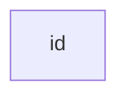
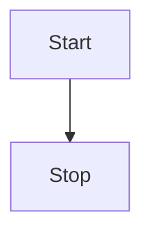
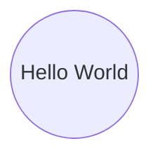
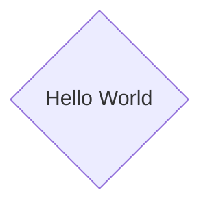
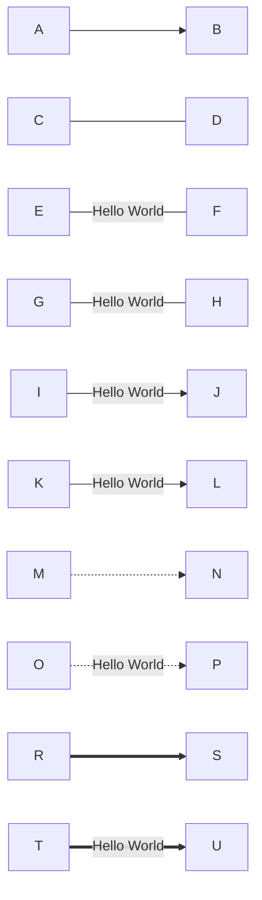
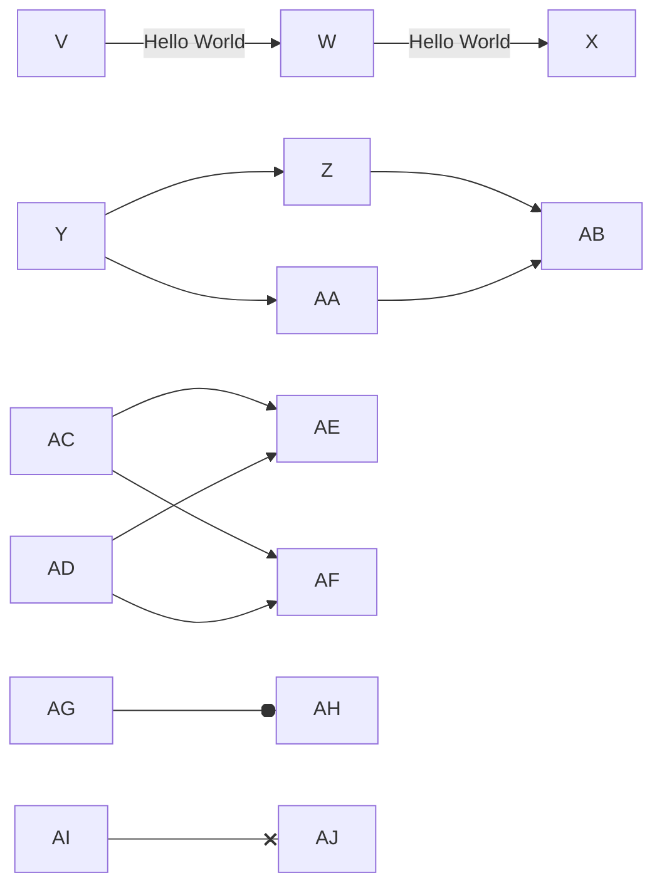
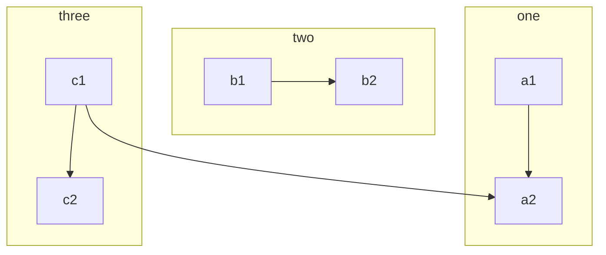

# 流程图（Flowcharts）

[https://mermaid-js.github.io/mermaid/#/flowchart](https://mermaid-js.github.io/mermaid/#/flowchart)

## 基本语法

所有流程图都由节点、几何形状和边缘、箭头或线条组成。美人鱼代码定义了这些节点和边的生成和交互方式。

它还可以容纳不同的箭头类型、多向箭头以及与子图的链接。

单个节点：

```txt
flowchart LR
	id
```



有文本的单个节点：

```txt
flowchart LR
	id[Hello World]
```


流程图的方向有两个：TD（或 TB）、LR

TD：从上往下

```txt
flowchart TD
	Start --> Stop
```



LR：从左往右

```txt
flowchart LR
	Start --> Stop
```


## 节点形状

具有圆边的节点

```txt
flowchart LR
	node(Hello World)
```


体育场状节点

```txt
flowchart LR
	node([Hello World])
```


子程序形状的节点

```txt
flowchart LR
	node[[Hello World]]
```


圆柱形状的节点

```txt
flowchart LR
	node[(Hello World)]
```


一个圆形的节点

```txt
flowchart LR
	node((Hello World))
```



不对称形状的节点

```txt
flowchart LR
	node>Hello World]
```


一个节点（菱形）

```txt
flowchart LR
	node{Hello World}
```



一个六边形节点

```txt
flowchart LR
	node{{Hello World}}
```


平行四边形

```txt
flowchart LR
	node[/Hello World/]
```


平行四边形 alt

```txt
flowchart LR
	node[\Hello World\]
```


梯形

```txt
flowchart LR
	node[/Hello World\]
```


梯形alt

```txt
flowchart LR
	node[\Hello World/]
```


## 节点之间的链接

```txt
flowchart LR
	A-->B
	C---D
	E-- Hello World --- F
	G---|Hello World| H
	I-->|Hello World| J
	K-- Hello World --> L
	M-.->N
	O-. Hello World .-> P
	R ==> S
	T == Hello World ==> U
```



```txt
flowchart LR
	V -- Hello World --> W -- Hello World --> X
	Y --> Z & AA --> AB
	AC & AD --> AE & AF
	AG --o AH
	AI --x AJ
```



```txt
flowchart LR
    A o--o B
    B <--> C
    C x--x D
```


## 子图（Subgraphs）

语法：

```txt
subgraph title
    graph definition
end
```

示例：

```txt
flowchart TB
    c1-->a2
    subgraph one
    a1-->a2
    end
    subgraph two
    b1-->b2
    end
    subgraph three
    c1-->c2
    end
```



可以为子图设置显式 id。

```txt
flowchart TB
    c1-->a2
    subgraph ide1 [one]
    a1-->a2
    end
```

```mermaid
flowchart TB
    c1-->a2
    subgraph ide1 [one]
    a1-->a2
    end
```

使用图类型流程图，还可以设置与子图之间的边，如下面的流程图所示。

```txt
flowchart TB
    c1-->a2
    subgraph one
    a1-->a2
    end
    subgraph two
    b1-->b2
    end
    subgraph three
    c1-->c2
    end
    one --> two
    three --> two
    two --> c2
```

```mermaid
flowchart TB
    c1-->a2
    subgraph one
    a1-->a2
    end
    subgraph two
    b1-->b2
    end
    subgraph three
    c1-->c2
    end
    one --> two
    three --> two
    two --> c2
```

## 注释

```txt
flowchart LR
%% this is a comment A -- text --> B{node}
   A -- text --> B -- text2 --> C
```

## 样式设置

可以对节点应用特定样式，例如较粗的边框或不同的背景颜色。

```txt
flowchart LR
    id1(Start)-->id2(Stop)
    style id1 fill:#f9f,stroke:#333,stroke-width:4px
    style id2 fill:#bbf,stroke:#f66,stroke-width:2px,color:#fff,stroke-dasharray: 5 5
```

```mermaid
flowchart LR
    id1(Start)-->id2(Stop)
    style id1 fill:#f9f,stroke:#333,stroke-width:4px
    style id2 fill:#bbf,stroke:#f66,stroke-width:2px,color:#fff,stroke-dasharray: 5 5
```

比每次都定义样式更方便的是定义一个样式类并将这个类附加到应该具有不同外观的节点上。

类定义类似于以下示例：

```txt
classDef className fill:#f9f,stroke:#333,stroke-width:4px;
```

将类附加到节点的操作如下：

```txt
class nodeId1 className;
```

也可以在一个语句中将一个类附加到节点列表：

```txt
class nodeId1,nodeId2 className;
```

添加类的更简短形式是使用`:::`运算符将类名附加到节点，如下所示：

```txt
flowchart LR
    A:::someclass --> B
    classDef someclass fill:#f96;
```

```mermaid
flowchart LR
    A:::someclass --> B
    classDef someclass fill:#f96;
```

如果一个类被命名为 default，它将被分配给所有没有特定类定义的类。

```txt
classDef default fill:#f9f,stroke:#333,stroke-width:4px;
```

## 对 fontawesome 的基本支持

可以从 fontawesome 添加图标。

图标通过语法 fa:#icon class name# 访问。

```txt
flowchart TD
    B["fa:fa-twitter for peace"]
    B-->C[fa:fa-ban forbidden]
    B-->D(fa:fa-spinner);
    B-->E(A fa:fa-camera-retro perhaps?);
```

```mermaid
flowchart TD
    B["fa:fa-twitter for peace"]
    B-->C[fa:fa-ban forbidden]
    B-->D(fa:fa-spinner);
    B-->E(A fa:fa-camera-retro perhaps?);
```

