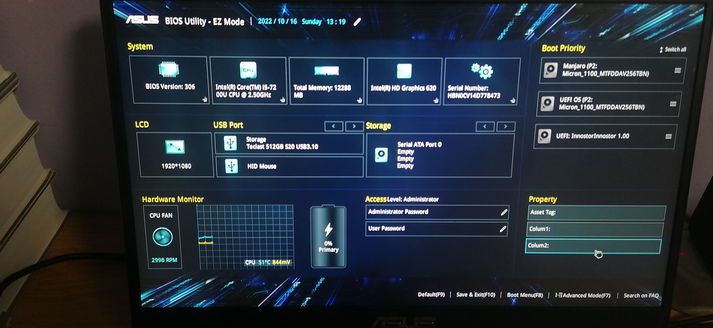
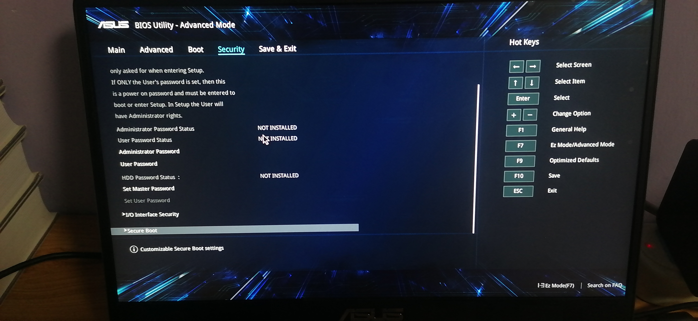
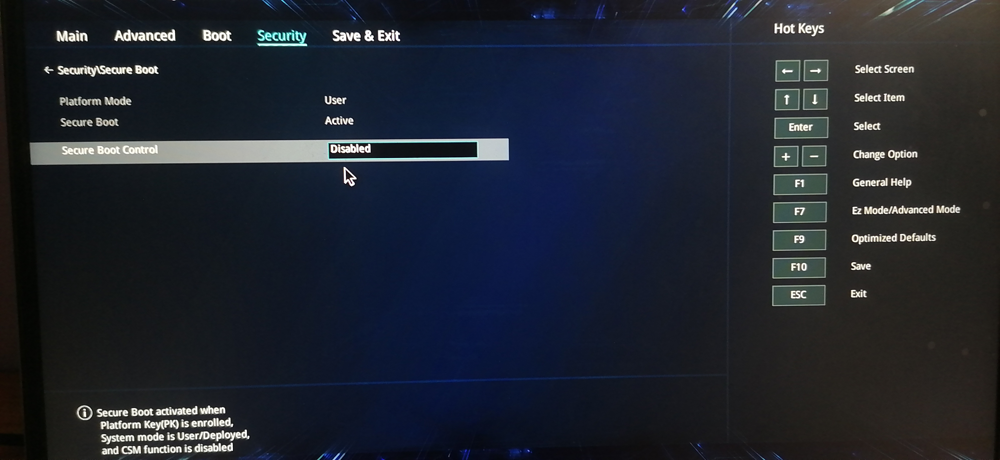
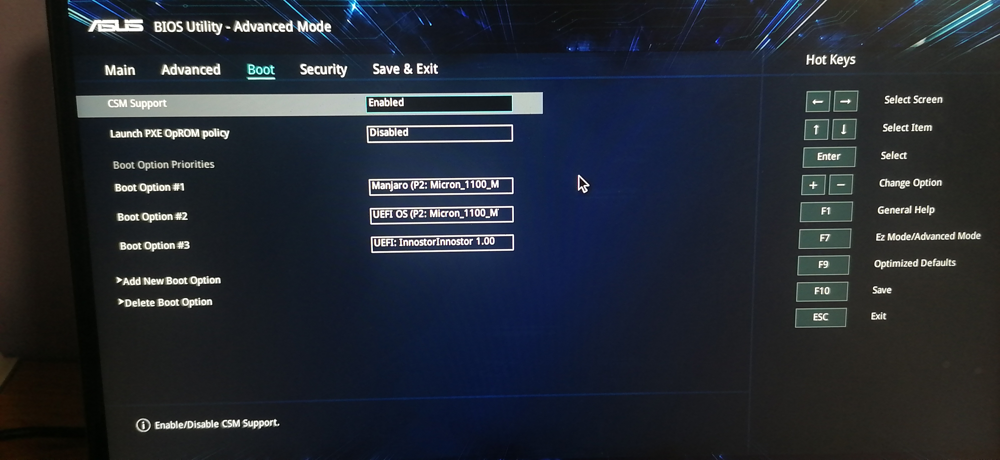

# [MBR 主引导记录](https://zh.wikipedia.org/zh-cn/%E4%B8%BB%E5%BC%95%E5%AF%BC%E8%AE%B0%E5%BD%95)

> **主引导记录**（Master Boot Record，缩写：MBR），又叫做**主引导扇区**，是[计算机](https://zh.wikipedia.org/wiki/计算机)开机后访问[硬盘](https://zh.wikipedia.org/wiki/硬盘)时所必须要读取的首个[扇区](https://zh.wikipedia.org/wiki/磁盘扇区)，它在硬盘上的三维地址为（柱面，磁头，扇区）＝（0，0，1）。在深入讨论主引导扇区内部结构的时候，有时也将其开头的446字节内容特指为“主引导记录”（MBR），其后是4个16字节的“磁盘分区表”（DPT），以及2字节的结束标志（55AA）。因此，在使用“主引导记录”（MBR）这个术语的时候，需要根据具体情况判断其到底是指整个主引导扇区，还是主引导扇区的前446字节。

# Hello World

MBR 是我们可以掌控的第一个程序，在这里我们通过它在屏幕上打印一个“Hello World”：

mbr.asm：

```assembly
; MBR 主引导记录
; MBR 只能使用 16 位的寄存器，这是 BIOS 的规范所要求的，因此，程序中使用的寄存器大多数是 16 位的
; ah、al等以“*h”、“*l”为名的寄存器是 8 位的寄存器，以寄存器 ax、ah、al 为例，ah 是 ax 的高 8 位，al 是 ax 的低 8 位，bh、bl 等寄存器以此类推
; vstart 是 mbr 程序的入口地址
section MBR vstart=0x7C00
    mov sp, $$

    ; 初始化段寄存器
    mov ax, 0
    mov ss, ax
    mov ds, ax
    mov fs, ax

    ; 设置显存的文本模式地址
    mov ax, 0xB800
    mov es, ax

    ; 清理屏幕
    mov cx, PAGE_SIZE
    mov di, 0
    .L1:
        mov dword [es: di], 0
        add di, 2
        loop .L1

    ; 将字符串写入显存
    mov cx, MESSAGE_LEN
    mov si, MESSAGE
    mov di, 0
    ; 设置文字样式，黑底白字
    mov ah, 0x07
    .L2:
        mov al, [si]
        mov [es: di], ax
        add si, 1
        add di, 2
        loop .L2

    ; 死循环，让指令流不再继续执行
    jmp $

; 显卡文本模式中，一页的内存大小
PAGE_SIZE equ 80 * 25 * 2
; 字符串
MESSAGE db "Hello World"
MESSAGE_LEN equ $ - MESSAGE
; 对剩余空间进行填充，让整个程序的总计大小为 512 B
times 510-($-$$) db 0
db 0x55, 0xAA
```

制作一个只包行 MBR 的镜像文件：

```bash
$ dd if=/dev/zero of=os.img bs=1MB count=1
$ nasm mbr.asm -o mbr
$ dd if=mbr of=os.img bs=512 count=1 conv=notrunc
```

使用 qemu 启动镜像：

```bash
$ qemu-system-i386 -drive 'file=os.img,format=raw'
```

# 通过 U 盘在物理机上执行 MBR

想要通过 U 盘在物理机上执行 MBR，需要进行两个步骤：在 BIOS 中开启 CSM 支持，以及在 MBR 头部填充 BPB 数据。

**开启 CSM 支持**

以华硕主板为例，需要进行以下几个步骤：

1. 开机时，按 f2 进入 BIOS
    
2. 进入 Advanced Mode，并切换到 Security 选项卡
    
3. 进入 Secure Boot，禁用 Secure Boot Control
    
4. 切换到 Boot 选项卡，启用 CSM 支持
    
5. 按 F10 保存配置并关机

**MBR 头部写入 BPB**

BIOS 如果把 U 盘作为软盘启动，它会在加载 MBR 之后，在 MBR 的头部写入一些 [BPB](https://en.wikipedia.org/wiki/BIOS_parameter_block) 数据，这会造成 MBR 的指令流或数据出现问题，使得程序不能按预期运行。

BPB 是卷引导记录 (VBR) 中描述数据存储卷的物理布局的数据结构。在分区设备（如硬盘）上，BPB 描述卷分区，而在未分区设备（如软盘）上，BPB 描述整个介质。

解决办法是在 MBR 的头部，填充一些 BPB 信息：

```assembly
; MBR 主引导记录
; MBR 只能使用 16 位的寄存器，这是 BIOS 的规范所要求的，因此，程序中使用的寄存器大多数是 16 位的
; ah、al等以“*h”、“*l”为名的寄存器是 8 位的寄存器，以寄存器 ax、ah、al 为例，ah 是 ax 的高 8 位，al 是 ax 的低 8 位，bh、bl 等寄存器以此类推
; vstart 是 mbr 程序的入口地址
section MBR vstart=0x7C00
    jmp main

    ; Dos 4.0 EBPB 1.44MB 软盘的分区信息
    OEMname: db "mkfs.fat"
    ; 每个逻辑扇区的字节数
    bytesPerSector: dw 512
    ; 每个集群的逻辑扇区
    sectPerCluster: db 1
    ; 保留的逻辑扇区
    reservedSectors: dw 1
    ; FAT 数量
    numFAT: db 2
    ; 根目录条目
    numRootDirEntries: dw 224
    ; 总逻辑扇区
    numSectors: dw 2880
    ; 媒体描述符
    mediaType: db 0xf0
    ; 每个 FAT 的逻辑扇区
    numFATsectors: dw 9
    ; 每个磁道的物理扇区
    sectorsPerTrack: dw 18
    ; 磁头数量
    numHeads: dw 2
    ; 隐藏扇区
    numHiddenSectors: dd 0
    ; 大的总逻辑扇区
    numSectorsHuge: dd 0
    ; 物理驱动器号
    driveNum: db 0
    ; Flags 等
    reserved: db 0
    ; 扩展引导签名
    signature: db 0x29
    ; 卷序号
    volumeID: dd 0x2d7e5a1a
    ; 卷标识
    volumeLabel: db "NO NAME    "
    ; 文件系统类型
    fileSysType: db "FAT12   "

    MESSAGE: db "Hello World"
    MESSAGE_LEN: equ $ - MESSAGE
    PAGE_SIZE: equ 80 * 25 * 2

main:
    mov sp, $$

    ; 初始化寄存器
    mov ax, 0
    ; ds、es、fs、gs 这类段寄存器不能通过立即数初始化，需要通过别的寄存器进行中转
    mov ss, ax
    mov ds, ax
    mov fs, ax

    mov ax, 0xB800
    mov es, ax

    mov cx,PAGE_SIZE
    mov di, 0
    .L1:
        mov dword [es: di], 0
        add di, 2
        loop .L1

    mov si, MESSAGE
    mov di, 0
    mov cx, MESSAGE_LEN
    mov ah, 0x07
    .L2:
        mov al, [si]
        mov [es: di], ax
        add si, 1
        add di, 2
        loop .L2

    jmp $

; 对剩余空间进行填充，让整个程序的总计大小为 512 B
times 510-($-$$) db 0
db 0x55, 0xAA
```


