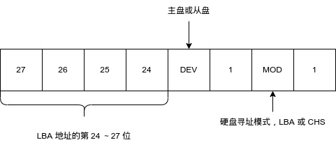
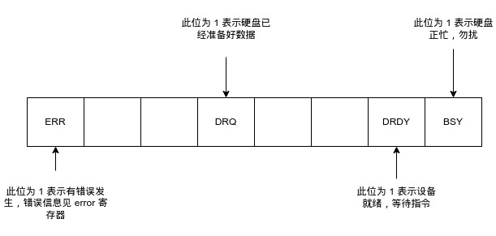

# 简介

本文用于记录 OS 中的一些笔记

# OS 基本概念

## 内核模式和用户模式

内核模式和用户模式是相对于 CPU 而言的。 内核模式是指运行在特权级别 0 的 CPU，而用户模式是指运行在特权级别 3 的 CPU。

用户进程进入内核态：表示当前进程由于来自内核或外部的中断而暂时终止执行，并在中断程序保存其上下文后开始执行一段内核代码。

应用程序可以直接跨标准库执行系统调用。 对于Linux系统，直接嵌入汇编代码`int 0x80`即可直接执行系统调用。 当然，系统调用子函数号要提前准备好，子函数号使用寄存器`eax`存储。

## [x86 内存分段](https://zh.wikipedia.org/zh-cn/X86%E8%A8%98%E6%86%B6%E9%AB%94%E5%8D%80%E6%AE%B5)

x86 架构的 CPU，使用段基地址 + 段内偏移的方式访问内存，并不是直接使用物理地址访问内存。段基地址存储于各个段寄存器中：

* 代码段寄存器 CS 与寄存器IP相配合获得当前线程代码执行到的内存位置
* 数据段寄存器 DS 与各通用寄存器配合访问内存中的数据
* 栈段寄存器 SS 与寄存器 (E)SP、(E)BP 配合访问线程的调用栈（call stack）
* 扩展段寄存器 ES 用于特定字符串指令（如 MOVS 或 CMPS）。
* 80386引入了2个额外的段寄存器 FS 与 GS，并无特定的硬件用途。

由于因特尔 8086 CPU 的段寄存器是16位的，只能访问 64 KB 内存，而内存地址总线是20位的，可以访问 1 MB 内存，因此，内存物理地址的计算公式为：物理地址 = 段基址 \* 16 + 段内偏移地址。

## [实模式和保护模式](https://zh.wikipedia.org/zh-cn/X86%E8%A8%98%E6%86%B6%E9%AB%94%E5%8D%80%E6%AE%B5#80286%E4%BF%9D%E6%8A%A4%E6%A8%A1%E5%BC%8F)

> Intel 80286 处理器仍然使用 16 位段寄存器与 16 位的段内偏移地址，但保护模式下支持访问 224（16M）字节的内存。16 位段寄存器内不再是段地址，**16 位段寄存器的高 13 位被称作段选择符（segment selector），其值是到段描述符表的索引值。**段描述符中包含了 24 位的段开始的基地址，20 位的段长度。段开始地址与段内偏移地址相加即为内存物理地址。段的长度上限为 220 = 1M 字节。
>
> Intel 80386 处理器继续使用 286 的分段保护模式，但段描述符中包含了 32 位的段开始的基地址。段内偏移地址也是 32 位。在分段转址与物理地址之间又增加了一层**分页（paging）转址**。分段寻址是不能关闭的。分页可以使能或关闭（enabled or disabled），如果关闭就与 286 保护模式一样。**如果使用分页机制，则由段开始的基地址与段内偏移地址相加得到的是线性地址（虚地址），线性地址还需要分页转址才得到内存物理地址。**

## 电脑启动时的加载顺序

在主板接通电源后，CPU 会首先从主板的固件中，加载 BIOS 程序到地址 0xF0000～0xFFFFF 处，入口地址是 0xFFFF0。BIOS 会自动完成所有设备的开机自检，以及 USB 等外设的初始化工作，随后 BIOS 会读取各个存储器设备中，第一个扇区的 512 个字节，如果这 512 个字节的最后两个字节是 0x55 和 0xAA，BIOS 就会认为前 510 个字节为 [MBR 主引导记录](mbr.md)，会将其加载到 0x7C00 处，并开始执行 MBR 程序，由 MBR 负责启动操作系统的主引导器。

# IO 接口

IO 接口是连接 CPU 与外部设备的逻辑控制部件，分为硬件和软件两部分，硬件部分的功能是协调 CPU 和外设之间的种种不匹配，例如双方的速度不匹配，那 IO 接口就实现数据缓冲以减少等待时间，数据格式不匹配，IO 接口就在这两种格式间互相转换。IO 接口内部实际上也是由软件（驱动程序）来控制运作的，这就是所谓的逻辑部分。

对 IO 接口的操作有两种方式，一种是通过 CPU 的地址总线进行操作，比如显存被映射到地址 0xB8000 ～ 0xA0000，想要往屏幕上输出 ASCII 字符，只需要通过 mov 指令向该地址写入数据即可，另一种方式是通过 IO 端口进行操作，IO 端口实际上是 IO 寄存器，不同的接口，IO 寄存器是不一样的。

IO 接口主要功能如下：

* 设置数据缓冲，解决 CPU 与外设之间的速度不匹配
* 设置信号电平转换电路
    CPU 和外设的信号电平不同，如 CPU 所用的信号是 TTL 电平，而外设大多数机电设备，因此不能使用 TTL 电平驱动，可以在接口电路中设置电平转换电路来解决
* 设置数据格式转换
    外设是多种多样的，输出的信息可能是数字信号，模拟信号等，而 CPU 只能处理数字信号。数字信号需要经过数/模转换（D/A）成模拟量才能被送到外设以驱动硬件，模拟量也同样需要经过数/模转换（A/D）转换成数字量才能被 CPU 处理。即使双方都使用数字信号，这也会牵扯到字长问题，如 CPU 使用的是 8 位、16 位、32 位并行数据，而外设使用并行或串行数据都有可能。
* 设置时序控制电路来同步 CPU 和外部设备
    硬件的工作也按照某种时序，它们都用自己的时序系统，就像 CPU 工作在自己的晶振时序上一样，双方时序不同，接口电路就要协调这两种不同的时间记法。
* 提供地址译码
    CPU 同多个硬件打交道，每个硬件要反馈的信息很多，所以一个 IO 接口必须包含多个端口，即 IO 接口上的寄存器，来存储这些内容。但同一时刻，只能有一个端口和 CPU 进行数据交换，这就需要 IO 接口提供地址译码电路，使 CPU 可以选中某个端口，使其可以访问数据总线。

## IO 接口种类

### [串行端口](https://en.wikipedia.org/wiki/Serial_port)

串行端口是一次只能传输一位的端口。 在 20 世纪末，它的缺点是传输速度慢，但从 21 世纪初开始，它通过增加数据传输频率来提高数据传输速度。

### [并行端口](https://en.wikipedia.org/wiki/Parallel_port)

并行端口是一次可以传输多个位的端口。 20世纪末，它的传输速度比串口还快，得到了广泛的应用。 但它有一个缺陷，它必须同时发送多位数据，多位数据也必须同时到达，如果一位数据丢失，则必须重新发送多位数据。

### [USB](https://en.wikipedia.org/wiki/USB)

串行和并行端口已在很大程度上被 USB 端口所取代。 USB 本质上是对串行端口的改进，其接口内部有多个串行端口，称为端点。

USB 也可以并行传输，但与并行端口不同的是，如果在传输过程中数据丢失，则不需要重新发送所有数据。

例如，如果同时发送8位数据，如果一位发送失败，则并口需要重新发送8位数据，而USB只需要重新发送丢失的位数据。

每个 USB 端口都有一个对应的编号。 默认端口 0 作为控制端口，用于传输控制命令。 USB 主机可以通过命令指定使用哪些端口进行传输。

## [输入输出控制芯片](https://zh.wikipedia.org/zh-cn/%E5%8D%97%E6%A1%A5)

输入输出控制芯片（I/O control hub，ICH），也称南桥芯片。同一时刻，CPU 只能和一个 IO 接口通信，当很多的 IO 接口同时想和 CPU 对话时，南桥负责仲裁 IO 接口的竞争。南桥包含大多数周边设备接口、多媒体控制器和通信接口功能。例如 PCI / 低速 PCIe（如 PCIe x1）控制器、ATA/SATA 控制器、USB 控制器、网络控制器、音效控制器。

[北桥](https://zh.wikipedia.org/zh-cn/%E5%8C%97%E6%A1%A5)和南桥总是成对出现，北桥用来处理高速信号，例如中央处理器、存储器、集成式 GPU、高速总线（如 [PCI Express](https://zh.wikipedia.org/zh-cn/PCI_Express) 接口或 [AGP](https://zh.wikipedia.org/zh-cn/AGP) 接口）控制器，还有与南桥之间的通信。

## [显卡](https://zh.wikipedia.org/zh-cn/%E6%98%BE%E7%A4%BA%E5%8D%A1)

显示适配器，简称显卡。CPU 无论是要操作 [LCD 显示器](https://zh.wikipedia.org/zh-cn/%E6%B6%B2%E6%99%B6%E6%98%BE%E7%A4%BA%E5%99%A8)，还是操作 [OLED 显示器](https://zh.wikipedia.org/zh-cn/%E6%9C%89%E6%A9%9F%E7%99%BC%E5%85%89%E4%BA%8C%E6%A5%B5%E9%AB%94)，都需要通过显卡来完成。CPU 需要通过 mov 指令将要显示的数据发写入显存。显卡有三种工作模式：文本模式、黑白图形模式和彩色图形模式。在黑白图形模式下，显存的 1 bit 对应显示器的 1 个像素，在文本和彩色图形模式下，显存的 24 bit 对应 1 个像素，也就是 24 位真彩色。

### 显存地址分布

| 起始    | 结束    | 大小  | 用途                   |
| ------- | ------- | ----- | ---------------------- |
| 0xC0000 | 0xC7FFF | 32 KB | 显示适配器 BIOS        |
| 0xB8000 | 0xBFFFF | 32 KB | 用于文本模式显示适配器 |
| 0xB0000 | 0xB7FFF | 32 KB | 用于黑白显示器         |
| 0xA0000 | 0xAFFFF | 64 KB | 用于彩色显示器         |

### 文本模式

显卡的文本模式也分为多种模式，用“列数 \* 行数”来表示，如 $80 \times 25$、$80 \times 43$ 等，默认是 $80 \times 25$。在文本模式下，也可以打印彩色的字符，每个字节都用 2 个字节来表示，一个字节是 ASCII 码本身，另一个字节表示颜色。

文本模式的显存大小是 32 KB，一屏可以显示 $80 \times 25$ 个字符，每屏字符占用 $80 \times 25 \times 2 = 4000$ B，因此，文本模式可以有  $32 \times 1024 \div 4000 = 8.192 \approx 8$ 屏，这也是 Linux 8 个 tty 的切换原理。

每个字符的低字节是字符的 ASCII 码，高字节是字符的属性信息，低 4 位是字符背景色，高 4 位是字符的前景色。颜色用 RGB 三种基色混合，第 4 位用来控制亮度，为 1 是高亮，为 0 是正常亮度。第 7 位用来控制字符是否闪烁。

## 硬盘

### CHS 和 LBA

硬盘中的扇区在物理上是用“柱面 - 磁头 - 扇区”来定位的，简称为 CHS，CHS 的扇区编号是从 1 开始的。

另外一种定位称为 LBA（Logical Block Address）。LBA 的扇区编号从 0 开始，寻址时，不需要计算柱面和磁头。LBA 分为 LBA28 和 LBA48，LBA28 表示 28 位的 LBA 地址，最大支持 128 GB，LBA48 最大支持 128 PB。

### IO 端口

硬盘控制器主要 IO 端口（寄存器）：

| IO 端口                 |                | 端口名称         |                |
| ----------------------- | -------------- | ---------------- | -------------- |
| Primary 通道            | Secondary 通道 | 读操作时         | 写操作时       |
| Command Block registers |                |                  |                |
| 0x1F0                   | 0x170          | Data             | Data           |
| 0x1F1                   | 0x171          | Error            | Features       |
| 0x1F2                   | 0x172          | Sector count     | Sector count   |
| 0x1F3                   | 0x173          | LBA low          | LBA low        |
| 0x1F4                   | 0x174          | LBA mid          | LBA mid        |
| 0x1F5                   | 0x175          | LBA high         | LBA high       |
| 0x1F6                   | 0x176          | Device           | Device         |
| 0x1F7                   | 0x177          | Status           | Command        |
| Control Block registers |                |                  |                |
| 0x3F6                   | 0x376          | Alternate status | Device Control |

端口可以被分为两组：Control Block registers 和 Command Block registers，Command Block registers 用于向硬盘驱动器写入命令或者从硬盘控制器获得硬盘的状态，Control Block registers 用于控制硬盘工作状态。

端口是按通道给出的，不是直接和某块硬盘关联的，要想操作某通道上的某块硬盘，需要通过 device 寄存器指定。一个通道上就只能有主从两块硬盘，因此只需要 1 位就可以指定，0 表示主盘。1 为从盘。

各个端口的详细描述：

Data：在读写硬盘时，用于存储数据，大小是 16 位

Error、Features：在读取数据时，作为存储异常信息的寄存器，读取失败后，会记录失败的信息。在写入数据时，用于存储指令参数

  Sector count：指定待读取或写入的扇区数，硬盘每完成一个扇区，就会将此寄存器的值减 1,所以如果中间失败了，此寄存器中的值便是尚未完成的扇区。这是 8 位寄存器，最大值位 255，若指定为 0，则表示要写入 256 个扇区。

LBA low、LBA mid、LBA high：LBA low 存储 LBA 的第 0～7 位，LBA mid 存储第 8～15 位，LBA high 存储第16～23位

device：此寄存器的低 4 位用于存储 LBA 地址的第 24～27 位。第 5 位用来指定通道上的主盘或从盘，0 代表主盘，1 代表从盘。第 7 位用来设置是否启用 LBA 寻址方式，1 代表启用 LBA，0 代码使用 CHS。第 6位和第 8 位固定为 1，用途未知。

Status、Command：在读硬盘时，此寄存器用于给出硬盘的状态信息。第 0 位是 ERR 位，如果此位为 1，表示指令出错，具体原因保存在 error 寄存器，第 3 位是 data request 位，此位为 1，表示硬盘已经把数据准备好了，主机现在可以把数据读出来，第 6 位是 DRDY，表示硬盘准备就绪，第 7 位是 BSY 位，表示硬盘是否繁忙，如果为 1 表示硬盘正忙，此寄存器其他位都无效。
在写硬盘时，此寄存器用于存储指令。

device 寄存器示意图：

status 寄存器示意图：

### 数据传送方式

1. 查询传送方式
    也称为程序 IO（PIO，Programming Input/Output Model），CPU 先检查设备状态，如果状态为“准备好了可以发送”，CPU 再去获取数据
2. 中断传送方式
    也称中断启动 IO，当数据源设备准备好数据后，通过发送中断通知 CPU 获取数据
3. 直接存储器存取方式
    不让 CPU 参与传输，由 DMA 控制器完成数据传输，CPU 直接从内存读取数据就行
4. IO 处理机
    IO 处理机在 DMA 基础上，自动完成数据的交换、组合、校验等，让 CPU 完全不需要参与此类工作
