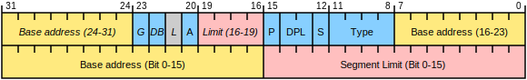

# 实模式

实模式下，CPU 仅能访问 1 MB 内存，其内存布局如下：

| 起始    | 结束    | 大小     | 用途                                                   |
| ------- | ------- | -------- | ------------------------------------------------------ |
| 0x00000 | 0x003FF | 1 KB     | 中断向量表                                             |
| 0x00400 | 0x004FF | 256 B    | BIOS Data Area（BIOS 数据区域）                        |
| 0x00500 | 0x07BFF | 30464 B  | 通用区域                                               |
| 0x07C00 | 0x07DFF | 512 B    | MBR 被 BIOS 加载到此处                                 |
| 0x07E00 | 0x9FBFF | 622080 B | 通用区域                                               |
| 0x9FC00 | 0x9FFFF | 1 KB     | 拓展 BIOS 数据区域                                     |
| 0xA0000 | 0xAFFFF | 64 KB    | 用于彩色显示器                                         |
| 0xB0000 | 0xB7FFF | 32 KB    | 用于黑白显示器                                         |
| 0xB8000 | 0xBFFFF | 32 KB    | 用于文本模式显示器                                     |
| 0xF0000 | 0xFFFEF | 64 KB    | BIOS                                                   |
| 0xFFFF0 | 0xFFFFF | 16 B     | BIOS 入口地址，此处是固定的内容，为 jmp 0xF000: 0xE05B |

实模式有以下缺陷：

1. 操作系统和用户程序属于同一个特权级，用户程序可以访问任意内存，甚至是需盖 OS 内核所在的内存。
2. 访问超过 64 KB 的内存区域时要切换段基址。
3. 一次只能运行一个程序
4. 只能访问 1 MB 内存

# 保护模式

保护模式的特点如下：

1. 段寄存器存储的不再是段基址，而是 [GDT](#全局描述符表) 的[选择子](#选择子)。
2. 基址寄存器不再只是 bx、bp，而是所有 32 位通用寄存器，变址寄存器也不再只是 si、di，而是除 esp 之外的所有 32 位通用寄存器。
3. 程序不能直接使用物理地址访问内存，只能通过虚拟地址访问内存。虚拟地址需要被转换为物理地址之后再去访问内存。地址转换是由处理器和 OS 共同协作完成的，处理器在硬件上提供地址转换部件，OS 提供转换过程中所需要的页表。

## [全局描述符表](https://en.wikipedia.org/wiki/Global_Descriptor_Table)

全局描述符表（Global Descriptor Table，GDT），是一个从 Intel 8086 处理器开始用于界定不同内存区域的特征数据结构。全局描述表位于内存中。全局描述表的条目描述及规定了不同内存分区的各种特征，包括基地址、大小和访问等特权如可执行和可写等。在 Intel 术语中，这些内存区域被称为段。

**segment descriptor 结构**

GDT 中，segment descriptor 的大小是 8 byte（64 bit），它的结构如图所示：



结构图分为上下两个部分，上半部分是高 32 bit，下班部分是低 32 bit。图中的各字段说明如下：

**Base Address**，段的起始内存地址。 它的长度为 32 位，由低位 16 到 23 位，高位 0 到 7 位，然后是 24 到 31 位组成。

**Segment Limit**，它的长度为 20 位，由低位 0 到 15 位和高位 16 到 19 位组成。它定义了使用该段描述符时，可访问的内存大小，$内存大小 = (\textrm{limit} + 1) \times 粒度$。

**G（Granularity）**，如果为 0，则以字节为单位，最大为 $2^{20}$ byte。 如果为 1，则以内存页为单位，每个内存页大小位 4096 byte，最大为 $2^{32}$ byte。

**D（Default operand size）**，如果为 0，表示这是一个 16 bit 代码段，如果为 1，表示这是一个 32 bit 段。

**B（Big）**，如果为 1，数据段的最大偏移量将增加到 32 位 0xffffffff。 否则，最大偏移量是 16 位 0x0000ffff。 本质上与“D”的含义相同。

**L（Long）**，如果为 1，表示这是一个 64 位段（ “D/B” 必须为零），并且该段中的代码使用 64 位指令编码。 L 和 D/B 不能同时为 1。

**AVL（Available）**，用于软件，不用于硬件（图像中带有标签 A 的位 20）。

**P（Present）**，如果为 0，则对该段的任何引用都会生成“段不存在”异常。

**DPL（Descriptor privilege level）**，访问此描述符所需的特权级别。

**S（System）**，表示是否为系统段，为 0 表示系统段，为 1 表示非系统段，数据段和代码段都是非系统段。

**Type**，随着 S 的不同，Type 的作用也不同，这里仅说明 S = 1 时的 Type。

该字段由 4 个位组成

第 1 位是：X（EXecutable），表示是否可执行。

第 2 位：当 X = 1 时，第 2 位是 R（Readable），表示是否可读，当 X = 0 时，第 2 位是 W（Writable），表示是否可写。

第 3 位：当 X = 1 时，第 3 位是 C（Conforming），表示是否为一致性代码段，如果 C 为 1，该段如果是转移目标，该段的特权级一定要高于当前特权级，转移后的特权级不以该段的 DPL 为主，而是与转移前的低特权级一致。当 X = 0 时，第 3 位是 E（Extend），用来标识段的拓展方向，为 0 表示向上拓展，地址越来越高，通常用于代码段和数据段，为 1 表示向下拓展，地址越来越低，通常用于栈段。

第 4 位：A（Accessed），这是由 CPU 来设置的，每当该段被 CPU 访问过后，CPU 就将此位设置为 1，所以，创建一个新的段描述符时，应将此位设置为 0。

顺便提一句，segment limit 和 base address 会被拆分为多个部分，主要是 Intel 为了对 80286 CPU 进行兼容。

**GDT 的使用**

GDT 存在于内存中，需要用 GDTR 寄存器指向它。GDTR 的结构如图所示：


limit 是 GDT 的界限，它的值是 GDT 的大小减 1，GDT start address 是 GDT 的起始地址。GDTR 寄存器的赋值不能使用 mov，必须使用 lgdt，该指令的操作数格式与 GDTR 寄存器的格式相同。

**选择子**

在保护模式下，段寄存器 CS、DS、ES、FS、GS、SS 中保存的不再是段基址，而是 GDT 的选择子。选择子的格式如图所示：


INDEX 是 GDT 的下标，RPL 是请求特权级，TI 用来指示段描述符的来源，为 0 表示从 GDT 获取段描述符，为 1 表示从 [LDT](#局部描述符表) 获取段描述符。

另外，值得一提的是，GDT 的索引从 1 开始，LDT 的索引从 0 开始。

## 局部描述符表

局部描述符表（Local Descriptor Table，LDT），本质上与 GDT 相同，不同的是，GDT 是全系统共享，往往的是单独存在，而 LDT 专门用于存储某一任务的段描述符，并且可以有多个 LDT 同时存在。。我目前猜测，这是硬件对于多进程的基本支持。

LDT 的寄存器是 LDTR，赋值指令是 lldt，指令格式为`lldt 16 位寄存器/16 位内存`，无论是 16 位寄存器，还是 16 位内存，其内容一定是一个选择子，该选择子用来在 GDT 中索引 LDT 的段描述符。

## 段描述符缓存寄存器

段描述符缓存寄存器的作用是缓存段描述符，避免 CPU 频繁的从 GDT 读取段描述符。每当更新段寄存器时，都会更新段描述符缓存寄存器。段描述符缓存寄存器结构如图：

80286 处理器：

| 47 ~ 32 | 31   | 30 ~ 29 | 28   | 27 ~ 24 | 23 ~ 0 |
| ------- | ---- | ------- | ---- | ------- | ------ |
| Limit   | P    | DPL     | S    | Type    | base   |

80386/80486 处理器：

| 95 ~ 64 | 63 ~ 32 | 31 ~ 24 | 23   | 22 ~ 21 | 20   | 19 ~ 16 | 15   | 14   | 13 ~ 0 |
| ------- | ------- | ------- | ---- | ------- | ---- | ------- | ---- | ---- | ------ |
| limit   | base    | 0       | P    | DPL     | S    | Type    | 0    | D/B  | 0      |

奔腾处理器：

| 95 ~ 79 | 78   | 77 ~ 72 | 71   | 70 ~ 69 | 68   | 67 ~ 64 | 63 ~ 32 | 31 ~ 0 |
| ------- | ---- | ------- | ---- | ------- | ---- | ------- | ------- | ------ |
| 0       | D/B  | 0       | P    | DPL     | S    | type    | base    | limit  |

## A20 地址线

在实模式下，如果段基址和段内便宜地址都是 16 位的最大值，即 0xFFFF: 0xFFFF，物理地址是 0x10FFEF，由于实模式下地址线是 20 位的，最大寻址空间是 1 MB，即 0x00000 ~ 0xFFFFF，超出 1 MB 内存的部分在逻辑上也是正常的，但物理内存中却没有与之对应的部分，对于这种情况，CPU 采取的做法是自动回绕到 0 地址，继续从 0 开始寻址。

8086 CPU 的地址线只有 20 位，编号为 A0 ~ A19，内存如果超过 1 MB，需要第 21 条地址线的支持，因此，访问超过 1 MB 的内存，就会导致地址丢掉最高的 1 位，自然也就从 0 开始了。

80286 之后的 CPU 通过 A20 GATE 来控制 A20 地址线，如果要访问更大的内存空间，必须要开启 A20 地址线。

## 打开保护模式

打开保护模式，总共需要三个步骤：

1. 准备好 GDT

2. 打开 A20 地址线，只需要将端口 0x92 的第 1 位置 1 即可，其代码如下：

    ```assembly
    ; 读取端口 0x92 的值
    in al, 0x92
    ; 通过异或将第 1 位置 1
    or al, 2
    ; 打开 A20 地址线
    out 0x92, al
    ```

3. 打开保护模式的开关，也就是将 CR0 寄存器的第 0 位置 1 即可，代码如下：
    ```assembly
    mov eax, cr0
    or eax, 1
    mov cr0, eax
    ```


# 内存分页机制

内存分页是现在主流的内存管理方式，它代替了分段管理内存的方式，在访问内存时，它不需要操作段寄存器，而可以对特定的内存进行保护，防止程序恶意篡改内存中的数据。
