# 简介

汇编语言笔记。<font color="red">在本文中，如果没有特殊说明，代码的都是基于x86指令集编写的</font>

# x86 或 AMD64 寄存器

可见寄存器：

| 16 位寄存器 | 32 位寄存器 | 64 位寄存器 | 描述                                     |
| ----------- | ----------- | ----------- | ---------------------------------------- |
| AH, AL      | EAX         | RAX         | 通用寄存器                               |
| BH, BL      | EBX         | RBX         | 通用寄存器                               |
| CH, CL      | ECX         | RCX         | 通用寄存器                               |
| DH, DL      | EDX         | RDX         | 通用寄存器                               |
| SIL         | ESI         | RSI         | 注册源索引（数据副本的源）               |
| DIL         | EDI         | RDI         | 注册目标索引（数据副本的目标）           |
| BPL         | EBP         | RBP         | 用于存放当前函数栈的基准地址             |
| SPL         | ESP         | RSP         | 用于存放当前函数栈的边界地址             |
| CS          | CS          |             | 代码段寄存器                             |
| DS          | DS          |             | 数据段寄存器                             |
| ES          | ES          |             | 拓展段寄存器                             |
| FS          | FS          |             | 拓展段寄存器                             |
| GS          | GS          |             | 拓展段寄存器                             |
| IP          | EIP         | RIP         | 指令寄存器，物理内存地址 = CS \* 16 + IP |
| R8B         | R8D         | R8          | 通用寄存器                               |
| R10B        | R10D        | R9          | 通用寄存器                               |
| R11B        | R11D        | R10         | 通用寄存器                               |
| R12B        | R12D        | R12         | 通用寄存器                               |
| R13B        | R13D        | R13         | 通用寄存器                               |
| R14B        | R14D        | R14         | 通用寄存器                               |
| R15B        | R15D        | R15         | 通用寄存器                               |

# Hello World

用汇编实现“Hello World”打印。

汇编器：[NASM](https://www.nasm.us/)

操作系统：Linux

CPU 架构：x86_64（64位）

本程序架构：x86（32位）

hello-world.asm:

```assembly
; 定义数据段，这是一个伪操作，用于告诉汇编器定义一块内存空间
section .data

; 定义数据段中的变量，这也是一个伪操作，所有对该变量的引用，都会被汇编器编译为内存地址
; DB 是伪指令，用于告诉汇编器，当前伪操作的每个操作数占用一个字节
; 0AH 用于写入一个换行符
STR_HELLO: DB "Hello World!", 0AH

; 计算字符串的长度
; equ 伪指令，表示操作数是一个表达式
; $ 应该是当前变量的地址
; 由于数据段的内存是连续的，当前变量地址 - 上一个变量地址 = 上一个变量的长度
STRLEN: equ $ - STR_HELLO

; 定义代码段，用于保存下面所有的汇编指令
section .text

; 定义程序入口，必须是“_start”
global _start
_start:
    ; 将变量 STRLEN 和 STR_HELLO 的地址分别放入寄存器 edx 和 ecx
    mov edx, STRLEN
    mov ecx, STR_HELLO

    ; 设置即将调用的 Linux 系统子功能号，4 表示 sys_write
    mov eax, 4
    ; 调用 Linux 的中断程序，开始执行指定的 Linux 子功能，当前进程暂停执行，由用户态转为内核态
    int 0x80

    ; 设置 Linux 系统子功能，1 表示 sys_exit
    mov eax, 1
    ; 设置进程的退出码
    mov ebx, 0
    ; 调用 Linux 的中断程序
    int 0x80

```

编译，以及生成可执行程序：

编译32位的程序：

```bash
# 使用 nasm 汇编器编译汇编
$ nasm -f elf hello-world.asm -o hello-world.o
# 使用链接器生成可执行程序
$ ld -m elf_i386 hello-world.o -o hello-world
```

编译64位的程序：

```bash
$ nasm -f elf64 hello-world.asm -o hello-world.o
$ ld hello-world.o -o hello-world
```

nasm 还支持第二种方式打印 hello world：

hello-world02.asm:

```assembly
global _start

section .data
message: db "Hello World", 10

section .text
_start:
    ; syscall for write
    mov rax, 1
    ; file handle 1 is stdout
    mov rdi, 1
    ; address of string to output
    mov rsi, message
    ; number of bytes
    mov rdx, 13
    ; invoke operating system to do the write
    syscall

    ; system call for exit
    mov rax, 60
    ; exit code 0
    mov rdi, 0
    ; invoke operating system to exit
    syscall
```

`syscall`只能作用于64位程序，暂时不知道原因，只能以64位模式编译程序：

```bash
$ nasm -f elf64 hello-world02.asm -o hello-world02.o
$ ld hello-world02.o -o hello-world02
```

# 函数调用

## call 的四种调用方式

* 相对近调用
    近调用：指调用的函数在同一个段中，无需跨段，即 cs 不变。
    相对：指待调用函数地址相对于下一条指令（即 call 的下一条），计算出一个偏移量。也就是说这个偏移量不是真正的段内偏移，而是相对位置偏移量。
    指令格式：`call near number`，默认是相对近调用。
    例如：假设目标函数地址是 0x9，相对的基准是 0x6，那么指令就是 `call near 0x03`。
* 间接绝对近调用
    间接：指不使用立即数作为函数地址，而是从寄存器或内存获得函数地址。
    绝对：得到的函数地址不进行相对量计算，直接跳转到该函数。
    例如：`mov [0x12345], 0x12345` 然后 `call near [0x12345]`
* 直接绝对远调用
    直接绝对：将操作数直接作为函数地址，不进行相对量计算。
    远调用：跨段访问，也就是 cs 和 ip 都需要改变。
    指令格式：`call far cs:ip`
    例如：`call far 0x10:0x99`
* 间接绝对远调用
    间接：函数的地址从内存读取
    例如：`call far [0x12345]`

## 过程调用

函数调用在汇编中，称为过程调用。汇编中的过程调用是通过指令 call 和 ret 完成的。call 指令将当前过程的返回地址压入堆栈，再把被调用过程的地址复制到指令指针寄存器。当过程准备返回时，它的 ret 指令从堆栈把返回地址弹回到 IP 寄存器。一个简单的示例如下：

```assembly
global _start

section .bss
BUFFER resb 2

section .data
STRLEN db 1

section .text
_start:
    mov byte [BUFFER], 97
    call demo
    mov byte [BUFFER + 1], 10

    ; 打印字符串
    mov edx, STRLEN
    mov ecx, BUFFER
    mov eax, 4
    int 0x80

    mov ebx, 0
    mov eax, 1
    int 0x80

demo:
    sub byte [BUFFER], 32
    ret
```

```bash
$ nasm -f elf demo.asm -o demo.o
$ ld -m elf_i386 demo.o -o demo
$ ./demo
A
```

## C 函数堆栈规范

在汇编中，其实并没有堆栈的概念。但是我们可以通过寄存器 ebp、esp 实现 C 函数的堆栈规范。C 函数堆栈主要有两个步骤：压栈、弹栈。

首先请看一段 C 代码：

```c
#include <stdio.h>

int sub(int a, int b) {
    int d;
    return a - b;
}

void _start() {
    printf("%c\n", demo(97, 32));
}
```

这段 C 代码的汇编对等实现

```assembly
global _start

section .bss
BUFFER resb 2

section .data
STRLEN db 1

section .text
_start:
    push ebp
    mov ebp, esp

    ; 将函数的参数压入堆栈，根据 C 的规范，需要从右往左依次压入参数
    ; 压入参数 b
    sub esp, 4
    mov dword [esp], 32
    ; 压入参数 a
    sub esp, 4
    mov dword [esp], 97
    call demo
    ; 回收 demo 函数的参数所占用的空间
    add esp, 8
    mov [BUFFER], eax
    mov byte [BUFFER + 1], 10

    ; 打印字符串
    mov edx, STRLEN
    mov ecx, BUFFER
    mov eax, 4
    int 0x80

    mov ebx, 0
    mov eax, 1
    int 0x80

demo:
    ; 创建栈帧
    ; 备份 ebp 的值
    sub esp, 4
    mov dword [esp], ebp
    mov ebp, esp
    ; 由于函数中存在局部变量 d，esp 需要给 d 腾出空间
    sub esp, 4

    ; 初始化 d
    mov dword [esp], 0
    ; 获取参数 a
    mov eax, [ebp + 8]
    ; 参数 a - 参数 b，函数返回值存放在 eax
    sub eax, [ebp + 12]

    ; 销毁栈帧
    ; esp 回归栈顶，销毁函数的局部变量占用的空间
    mov esp, ebp
    ; 恢复 ebp 的值，让 ebp 指向上一层堆栈的栈顶
    add esp, 4
    mov ebp, [esp]
    ret
```

```bash
$ nasm -f elf demo.asm -o demo.o
$ ld -m elf_i386 demo.o -o demo
$ ./demo
A
```

堆栈的整体布局如图所示：



x86 指令集提供三个指令简化压栈、弹栈操作：push、pop 和 leave：

```assembly
; 将操作数压入堆栈
push xxx
; 相当于
sub esp, 4
mov dword [esp], xxx
; 例如
push eax
push 0x1234
push [0x1234]

; 弹出堆栈，并将弹出的值保存到指定位置
pop xxx
; 相当于
add esp, 4
mov xxx, [esp]
; 例如
pop eax
pop [0x1234]

; 离开函数，销毁堆栈
leave
; 相当于
mov esp, ebp
pop ebp
```

对 esp 偏移量，应该取决于 CPU 的架构，16 位 CPU 偏移量 2，32 位 CPU偏移量 4，64 位 CPU 偏移量 8。

## 外部过程调用

除了调用同一个文件中的过程之外，还可以通过 ld 调用外部过程：

main.asm:

```assembly
; 声明此函数在别的文件中
extern print
; 声明程序入口，只能是 _start
global _start

; 自定义数据段，未使用“传统”的数据段 .data
section .data
; 在数据段中存放一个字符串，OA 是一个换行符
strHello db "Hello World!", 0AH
STRLEN equ $ - strHello

section .text
_start:
    ; 创建栈帧
    push ebp
    mov ebp, esp

    ; 传入参数，待打印的字符串
    push strHello
    ; 传入参数，字符串的长度
    push STRLEN
    ; 调用外部函数
    call print
    ; 回收 print 函数的参数占用的空间
    add esp. 8

    ; 函数调用完毕，退出程序
    ; 设置程序返回值（exit code）
    mov ebx, 0
    ; 设置系统子功能调用号，1: sys_exit
    mov eax, 1
    ; 触发中断，执行系统调用
    int 0x80
```

print.asm:

```assembly
; 导出 print，供其他模块使用
global print

; 自定义代码段
section .text
print:
    ; 创建栈帧
    ; 备份上一层函数的堆栈地址
    push ebp
    ; 将 ebp 更新为当前对战地址
    mov ebp, esp

    ; 字符串长度
    mov edx,[ebp+8]
    ; 设置要输出的字符串
    mov ecx,[ebp+12]

    ; 设置系统子功能号，4:sys_write
    mov eax, 4
    ; 开始系统调用
    int 0x80

    ; 即将离开函数，销毁栈帧
    leave
    ret
```

编译汇编，并生成可执行程序：

```bash
$ nasm -f elf64 main.asm -o main.o && nasm -f elf print.asm -o print.o
$ ld main.o print.o -o main
```

# 内存的读写

```assembly
; 未初始化的内存必须放在节 .bss 当中
section .bss
; 定义一块未初始化的内存
CACHE resb 10

section .text

; 打印内存中的内容
print:
    mov edx, [esp + 8]
    mov ecx, [esp + 4]
    mov eax, 4
    int 0x80
    ret

global _start
_start:
    ; 向指定的内存地址写入一些数据，[...] 表示操作数是一个内存地址
    ; byte 表示写入内存的数据大小是一个字节
    mov byte [CACHE], 97
    mov byte [CACHE + 1], 'a'
    mov byte [CACHE + 2], 10
    push 10
    push CACHE
    call print

    ; 通过减法，将一个字母转为大写字母
    mov eax, [CACHE]
    sub eax, 32
    mov [CACHE], eax
    push 10
    push CACHE
    call print

    ; 退出程序
    mov eax, 1
    mov ebx, 0
    int 0x80
```

# 调用 C 函数

以调用 C 的 printf 函数为例，代码如下：

```assembly
; 从 nasm 汇编调用 C 的 printf 函数

global main
extern printf, exit

section .data
FORMAT: db "%s", 10, 0
MESSAGE: db "Hello World", 0

section .text
main:
    push ebp

    push MESSAGE
    push FORMAT
    call printf

    push 0
    call exit
```

编译程序：

```bash
$ nasm -f elf demo.asm -o demo.o
$ gcc -no-pie -m32 demo.o -o demo
```

在 64 位程序中，函数的参数传递是优先存放在 6 个寄存器 rdi、rsi、rdx、rcx、r8、r9 当中，因此，64 位 printf 的参数传递也必须使用寄存器：

```assembly
; 64 位的 printf 使用寄存器 rdi、rsi、rdx、rcx、r8、r9 传递参数

global main
extern printf, exit

section .data
FMT db "%s", 10, 0
MESSAGE db "Hello World"

section .text
main:
    push rbp

    mov rdi, FMT
    mov rsi, MESSAGE
    call printf

    mov rdi, 0
    call exit
```

```bash
$ nasm -f elf64 demo.asm -o demo.o
# PIE 是用于可执行文件中的地址空间随机化的技术，PIC 是对地址空间通过偏移量进行相对定位，-no-pie 表示不使用 PIE，只使用 PIC
$ gcc -no-pie demo.o -o demo
```

无论是 32 位程序，还是 64 位程序，函数的返回值都是放在 eax 中。

在 64 位程序中，如果函数的参数的数量超过 6 个，剩余的参数还是会通过 push 压入堆栈的。

# 笔记参考

[带你弄懂 call 指令调用方式](https://tehub.com/a/8zVhecP9dd)
