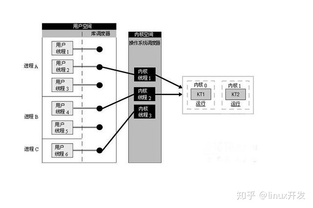
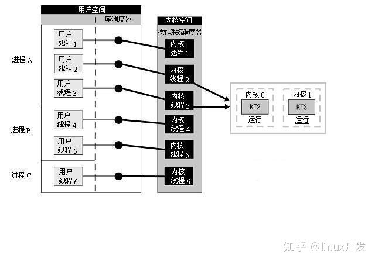
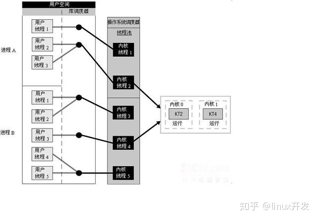
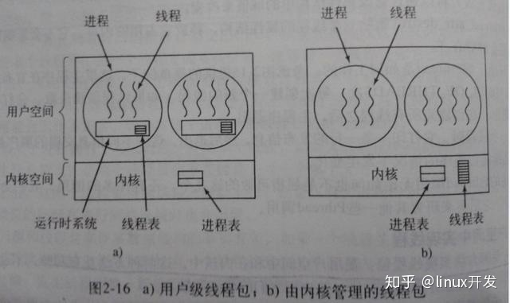

# Linux 多线程

## 轻量级进程（Light-weight process，LWP）

在计算机操作系统中，轻量级进程是一种实现多任务的办法。与普通的进程相比，LWP与其他进程共享所有（或大部分）它的逻辑地址和系统资源；与线程相比，LWP有它自己的进程标识符。<font color="green">并和其他进程有着子父级关系</font>；这是和类Unix操作系统的系统调用vfork()生成的进程一样的。另外，<font color="green">线程既可由应用程序管理，又可由内核管理，</font>而LWP只能由内核管理并像普通进程一样被调度。Linux内核是支持LWP的典型例子。

在大多数系统中，LWP与普通进程的区别也在于它只有一个最小的执行上下文和调度程序所需的统计信息，而这也是它之所以被称为轻量级的原因。一般来说，一个进程代表程序的一个实例，而LWP代表程序的执行线程（其实，在内核不支持线程的时候，LWP可以很方便地提供线程的实现）。因为一个执行线程不像进程那样需要那么多状态信息，所以LWP也不带有这样的信息。

<font color="green">因为LWP之间共享它们的大部分资源，所以它在某些应用程序就不适用了；这个时候就要使用多个普通的进程了。例如，为了避免内存泄漏（a process can be replaced by another one）和实现特权分隔（processes can run under other credentials and have other permissions）。</font>

<font color="green">使用多个进程也使得应用程序在出现进程池内的进程崩溃或被攻击的情况下变得更加健壮。</font>

<span style="background-color: greenyellow">有些情况下,也把内核级线程叫做轻量级进程(LWP), 但是这个是一个不准备的描述, 其实LWP的术语是借自于SVR4/MP和Solaris 2.x系统中, 有些系统将LWP称为虚拟处理器, 将之称为轻量级进程的原因可能是, 在内核线程的支持下，LWP是独立的调度单元，就像普通的进程一样。所以LWP的最大特点还是每个LWP都有一个内核线程支持。</span>

## 用户级线程

有关线程管理的所有工作都由应用程序完成，内核意识不到线程的存在.<font color="green"> 应用程序可以通过使用线程库设计成多线程程序. 通常，应用程序从单线程起始，在该线程中开始运行，在其运行的任何时刻，可以通过调用线程库中的派生例程创建一个在相同进程中运行的新线程。</font>

用户级线程驻留在用户空间或模式。运行时库管理这些线程，它也位于用户空间。它们对于操作系统是不可见的，因此无法被调度到处理器内核。每个线程并不具有自身的线程上下文。因此，就线程的同时执行而言，任意给定时刻每个进程只能够有一个线程在运行，而且只有一个处理器内核会被分配给该进程。对于一个进程，可能有成千上万个用户级线程，但是它们对系统资源没有影响。运行时库调度并分派这些线程。下图说明了用户级线程的实现方式,



如同在图中看到的那样，库调度器从进程的多个线程中选择一个线程，然后该线程和该进程允许的一个内核线程关联起来。内核线程将被操作系统调度器指派到处理器内核。用户级线程是一种”多对一”的线程映射。

**用户级线程的特点**

内核对线程包一无所知。从内核角度考虑，就是按正常的方式管理，即单线程进程（存在运行时系统）。

在用户级线程中，每个进程里的线程表由运行时系统管理。当一个线程转换到就绪状态或阻塞状态时，在该线程表中存放重新启动该线程所需的信息，与内核在进程表中存放的进程的信息完全一样。

**用户级线程的优点**

用户线程的优点主要有

1.  可以在不支持线程的操作系统中实现。
2.  创建和销毁线程、线程切换代价等线程管理的代价比内核线程少得多, 因为保存线程状态的过程和调用程序都只是本地过程
3.  <font color="green">允许每个进程定制自己的调度算法，线程管理比较灵活。这就是必须自己写管理程序，与内核线程的区别</font>
4.  线程能够利用的表空间和堆栈空间比内核级线程多
5.  不需要陷阱，不需要上下文切换，也不需要对内存高速缓存进行刷新，使得线程调用非常快捷
6.  线程的调度不需要内核直接参与，控制简单。

**用户线程的缺点**

1.  <font color="red">线程发生I/O或页面故障引起的阻塞时，如果调用阻塞系统调用则内核由于不知道有多线程的存在，而会阻塞整个进程从而阻塞所有线程, 因此同一进程中只能同时有一个线程在运行</font>
2.  页面失效也会产生类似的问题。
3.  一个单独的进程内部，没有时钟中断，所以不可能用轮转调度的方式调度线程
4.  <font color="red">资源调度按照进程进行，多个处理机下，同一个进程中的线程只能在同一个处理机下分时复用</font>

## 内核级线程

**线程的内核级线程实现**

在内核级线程中，内核线程建立和销毁都是由操作系统负责、通过系统调用完成的。在内核的支持下运行，无论是用户进程的线程，或者是系统进程的线程，他们的创建、撤销、切换都是依靠内核实现的。

线程管理的所有工作由内核完成，应用程序没有进行线程管理的代码，只有一个到内核级线程的编程接口. 内核为进程及其内部的每个线程维护上下文信息，调度也是在内核基于线程架构的基础上完成。图2-2(b)说明了内核级线程的实现方式。

内核线程驻留在内核空间，它们是内核对象。有了内核线程，每个用户线程被映射或绑定到一个内核线程。用户线程在其生命期内都会绑定到该内核线程。一旦用户线程终止，两个线程都将离开系统。这被称作”一对一”线程映射，

1.  线程的创建、撤销和切换等，都需要内核直接实现，即内核了解每一个作为可调度实体的线程
2.  这些线程可以在全系统内进行资源的竞争
3.  内核空间内为每一个内核支持线程设置了一个线程控制块（TCB），内核根据该控制块，感知线程的存在，并进行控制

如图所示,即内核级线程的实现方式, 每个用户线程都直接与一个内核线程相关联.



操作系统调度器管理、调度并分派这些线程。运行时库为每个用户级线程请求一个内核级线程。操作系统的内存管理和调度子系统必须要考虑到数量巨大的用户级线程。您必须了解每个进程允许的线程的最大数目是多少。操作系统为每个线程创建上下文。进程的每个线程在资源可用时都可以被指派到处理器内核。

**内核线程的特点**

当某个线程希望创建一个新线程或撤销一个已有线程时，它进行一个系统调用

**内核线程的优点**

1.  多处理器系统中，内核能够并行执行同一进程内的多个线程
2.  如果进程中的一个线程被阻塞，能够切换同一进程内的其他线程继续执行（用户级线程的一个缺点）
3.  所有能够阻塞线程的调用都以系统调用的形式实现，代价可观
4.  当一个线程阻塞时，内核根据选择可以运行另一个进程的线程，而用户空间实现的线程中，运行时系统始终运行自己进程中的线程
5.  信号是发给进程而不是线程的，当一个信号到达时，应该由哪一个线程处理它？线程可以“注册”它们感兴趣的信号

## 组合方式

在一些系统中，使用组合方式的多线程实现, 线程创建完全在用户空间中完成，线程的调度和同步也在应用程序中进行. 一个应用程序中的多个用户级线程被映射到一些（小于或等于用户级线程的数目）内核级线程上。

下图说明了用户级与内核级的组合实现方式, 在这种模型中，<font color="green">每个内核级线程有一个可以轮流使用的用户级线程集合</font>



<font color="green">posix线程调度是一个混合模型，很灵活，足以在标准的特定实现中支持用户级和内核级的线程。</font>模型中包括两级调度–线程及和内核实体级。线程级与用户级线程类似，内核实体由内核调度。由线程库来决定它需要多少内核实体，以及他们是如何映射的。

POSIX 引入了一个<font color="green">线程调度竞争范围(thread-scheduling contention scope)</font>的概念，这个. 概念赋予了程序员一些控制权，使它们可以控制怎样将内核实体映射为线程。线程的contentionscope属性可是PTHREAD_SCOPE_PROCESS,也可以是PTHREAD_SCOPE_SYSTEM。<font color="green">带有**PTHREAD_SCOPE_PROCESS**属性的线程与它所在的进程中的其他线程竞争处理器资源。带有**PTHREAD_SCOPE_SYSTEM**属性的线程很像内核级线程，他们在全系统的范围内竞争处理器资源。</font>POSIX的一种映射方式将PTHREAD_SCOPE_SYSTEM线程和内核实体之间绑定起来。

内核级线程创建时先设置线程属性PTHREAD_SCOPE_SYSTEM，代码如下，:

```c
pthread_attr_t attr;
pthread_attr_init(&attr);
pthread_attr_setscope(&attr, PTHREAD_SCOPE_SYSTEM); //设置内核级的线程,以获取较高的响应速度，绑定到某个轻进程
//创建线程
ret = pthread_create(&iAcceptThreadId, &attr, AcceptThread, NULL);
```

POSIX的标准中定义了两个值：

PTHREAD_SCOPE_SYSTEM和PTHREAD_SCOPE_PROCESS，前者表示与系统中所有线程一起竞争CPU时间，后者表示仅与同进程中的线程竞争CPU

默认为PTHREAD_SCOPE_PROCESS。<font color="red">目前LinuxThreads仅实现了PTHREAD_SCOPE_SYSTEM一值。</font>

关于线程的绑定，牵涉到另外一个概念：轻进程（LWP：Light Weight Process）。<font color="green">轻进程可以理解为内核线程，它位于用户层和系统层之间。系统对线程资源的分配、对线程的控制是通过轻进程来实现的，一个轻进程可以控制一个或多个线程。</font>默认状况下，启动多少轻进程、哪些轻进程来控制哪些线程是由系统来控制的，这种状况即称为非绑定的。绑定状况下，则顾名思义，即<font color="green">某个线程固定的”绑”在一个轻进程之上。被绑定的线程具有较高的响应速度，</font>这是因为<font color="red">CPU时间片的调度是面向轻进程的</font>，<font color="green">绑定的线程可以保证在需要的时候它总有一个轻进程可用。</font>通过设置被绑定的轻进程的优先级和调度级可以使得绑定的线程满足诸如实时反应之类的要求。

设置线程绑定状态的函数为pthread_attr_setscope，它有两个参数，第一个是指向属性结构的指针，第二个是绑定类型，它有两个取值：PTHREAD_SCOPE_SYSTEM（绑定的）和PTHREAD_SCOPE_PROCESS（非绑定的）。

## 总结

1.  内核支持线程是OS内核可感知的，而用户级线程是OS内核不可感知的。
2.  用户级线程的创建、撤消和调度不需要OS内核的支持，是在语言（如Java）这一级处理的；而内核支持线程的创建、撤消和调度都需OS内核提供支持，而且与进程的创建、撤消和调度大体是相同的。
3.  用户级线程执行系统调用指令时将导致其所属进程被中断，而内核支持线程执行系统调用指令时，只导致该线程被中断。
4.  在只有用户级线程的系统内，CPU调度还是以进程为单位，处于运行状态的进程中的多个线程，由用户程序控制线程的轮换运行；在有内核支持线程的系统内，CPU调度则以线程为单位，由OS的线程调度程序负责线程的调度。
5.  用户级线程的程序实体是运行在用户态下的程序，而内核支持线程的程序实体则是可以运行在任何状态下的程序。



