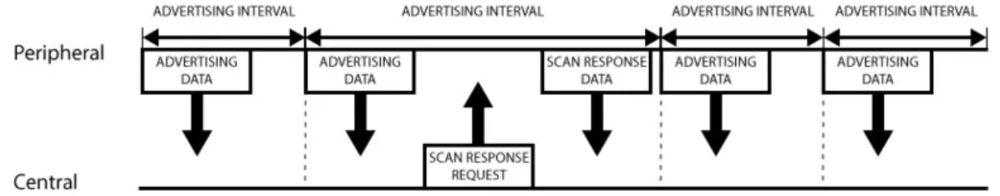
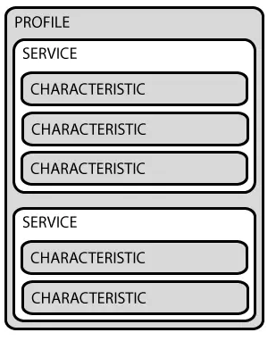

# 简介

[蓝牙（Bluetooth Classic）](https://www.bluetooth.com/zh-cn/)，一种低功率无线电，在 2.4GHz 非授权工业、科学和医疗（ISM）频段的 79 个频道上进行数据流传输。支持点对点通信，只要用于实现无线音频流。

# GAP

通用访问配置文件（Generic Access Profile, GAP），该 Profile 保证不同的 Bluetooth 产品可以互相发现对方并建立连接。

## 设备角色

GAP 给设备定义了几个角色，最主要的是：**外围设备**（Peripheral）和**中心设备**（Central）。
**外围设备**：一般是非常小或简单的低功耗设备，用来提供数据并连接到一个更加相对强大的中心设备。例如小米手环。

**中心设备**：中心设备相对比较强大，用来连接其它外围设备。例如手机等。

## 广播

在 GAP 中，外围设备通过两种方式向外广播数据：Advertising Data Payload（广播数据）和 Scan Response Data Payload（扫描回复），每种数据最长可以包含 31Byte。外设必须不停地向外广播，扫描回复则是可选的，中心设备可以向外设请求扫描回复。广播的流程如图所示：

从图中可以看出外围设备会设定一个广播间隔，每个广播间隔中，它会重新发送自己的广播数据，广播间隔越长越省电，同时也不太容易被扫描到。

# GATT

Generic Attribute Profile，它定义两个 BLE 设备通过叫做 Service 和 Characteristic 的东西进行通信。GATT 就是使用了 **ATT**（Attribute Protocol）协议，ATT 把 Service 和 Characteristic 的对应关系保存在一个查找表中，使用 16Bit ID 作为每一项的索引。

GATT 连接必须先经过 GAP 协议，可以直接使用外设的蓝牙 MAC 地址发起连接，这样是不需要先扫描（配对）设备的，蓝牙芯片上控制器会自动通过 GAP 获取所需的设备信息。**GATT 的连接是独占的**，一个 BLE 外设同时只能被一个中心设备连接，一旦外设被连接，它就会马上停止广播，当设备断开又开始广播。中心设备和外设需要双向通信的话，唯一的方式就是建立 GATT 连接。

GATT 通信的双方是 C/S 关系。外设作为 GATT 服务端（Server），它维持了 ATT 的查找表以及 Service 和 Characteristic 的定义。中心设备是 GATT 客户端（Client），它向 Server 发起连接请求。

GATT 结构：

* Profile Profile 并不是实际存在于 BLE 外设上的，它只是一个被 Bluetooth SIG 或者外设设计者预先定义的 Service 的集合。例如心率 Profile（Heart Rate Profile）就是结合了 Heart Rate Service 和 Device Information Sercvice。所有官方通过 GATT Profile 的列表可以从这里找到。
* Service Service 是把数据分成一个个的独立逻辑项，它包含一个或者多个 Characteristic。每个 Service 有一个 UUID 唯一标识。UUID 有 16bit 的，或者 128bit 的。16bit 的 UUID 是官方通过认证的，需要花钱购买，128bit 是自定义的，这个就可以自己随便设置。
    官方通过了一些标准 Service，完整列表在这里。以 Heart Rate Service 为例，可以看到它的官方通过 16bit UUID 是 0x180D，包含 3 个 Characteristic：Heart Rate Measurement，Body Sensor Location 和 Heart Control Point，并且定义了只有一个第一个必须的，它是可选实现的。
* Characteristic 在 GATT 事务中的最低界别的是 Characteristic，Characteristic 是最小的逻辑数据单元，当然它可能包含一个组关联的数据，例如加速度计的 X/Y/Z 三轴值。与 Service 类似，每个Characteristic 用 16bit 或者 128bit 的 UUID 唯一标识。你可以免费使用 Bluetooth SIG 官方定义的标准 Characteristic，使用官方定义的，可以确保 BLE 的软件和硬件能相互理解。当然，你可以自定义Characteristic，这样的话，就只有你自己的软件和外设能够相互理解。
    举个例子，Heart Rate Measurement Characteristic，这是上面提到的 Heart Rate Service 必需实现的 Characteristic，它的 UUID 是 0x2A37。它的数据结构是，开始 8bit 定义心率数据格式（是 UINT8 还是 UINT16？），接下来就是对应格式的实际心率数据。
    实际上，和 BLE 外设打交道，主要是通过 Characteristic。你可以从 Characteristic 读取数据，也可以往 Characteristic 写数据。这样就实现了双向的通信。所以你可以自己实现一个类似串口（UART）的service，这个 Service 中包含两个 Characteristic，一个被配置只读的通道（RX），另一个配置为只写的通道（TX）。

# RFCOMM

RFCOMM 是一种简单的传输协议，具有用于模拟 [RS-232](https://zh.wikipedia.org/wiki/RS-232) 串行端口的九个电路的附加规定。RFCOMM 协议支持两个蓝牙设备之间最多 60 个同时连接。 蓝牙设备中可以同时使用的连接数量是特定于实现的。