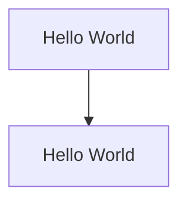
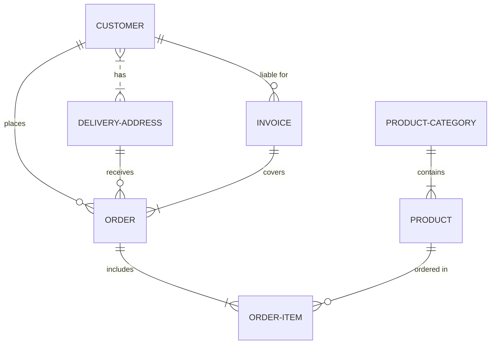
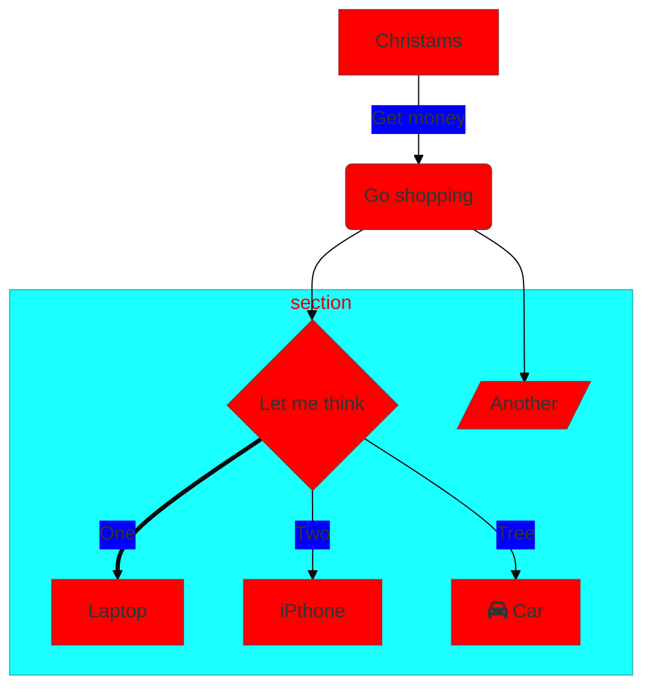

美人鱼（Mermaid ['mɜːmeɪd]）](https://mermaid-js.github.io/mermaid/#/README?id=about-mermaid)

## 简介

它是一种基于 Javascript 的**图表工具**，可呈现受 Markdown 启发的文本定义以动态创建和修改图表。

**相关网站：**[在线语法文档](https://mermaid-js.github.io/mermaid/#/./n00b-syntaxReference)、[在线编辑器](https://mermaid-js.github.io/mermaid-live-editor/edit#eyJjb2RlIjoiZ3JhcGggVERcbiAgICBBW0NocmlzdG1hc10gLS0-fEdldCBtb25leXwgQihHbyBzaG9wcGluZylcbiAgICBCIC0tPiBDe0xldCBtZSB0aGlua31cbiAgICBDIC0tPnxPbmV8IERbTGFwdG9wXVxuICAgIEMgLS0-fFR3b3wgRVtpUGhvbmVdXG4gICAgQyAtLT58VGhyZWV8IEZbZmE6ZmEtY2FyIENhcl1cbiAgIiwibWVybWFpZCI6IntcbiAgXCJ0aGVtZVwiOiBcImRlZmF1bHRcIlxufSIsInVwZGF0ZUVkaXRvciI6dHJ1ZSwiYXV0b1N5bmMiOnRydWUsInVwZGF0ZURpYWdyYW0iOnRydWV9)、[在线示例](https://mermaid-js.github.io/mermaid/#/README?id=about-mermaid)

## 在Markdown中的基本用法

比如创建一个从上往下的流程图：

````txt

````

效果如下：


## 查看Mermaid版本

````txt
```mermaid
info
```
````


```mermaid
info
```


## 示例

这是一个实体关系图示例

```txt
erDiagram
	CUSTOMER }|..|{ DELIVERY-ADDRESS : has
	CUSTOMER ||--o{ ORDER : places
	CUSTOMER ||--o{ INVOICE : "liable for"
	DELIVERY-ADDRESS ||--o{ ORDER : receives
	INVOICE ||--|{ ORDER : covers
	ORDER ||--|{ ORDER-ITEM : includes
	PRODUCT-CATEGORY ||--|{ PRODUCT : contains
	PRODUCT ||--o{ ORDER-ITEM : "ordered in"
```




这些特殊的字符会导致图标的中断：

| 图表断路器                                                   | 原因                                                         | 解决方案                               |
| ------------------------------------------------------------ | ------------------------------------------------------------ | -------------------------------------- |
| **Comments**                                                 |                                                              |                                        |
| [`%%{``}%%`](https://github.com/mermaid-js/mermaid/issues/1968) | 类似于 [Directives](https://mermaid-js.github.io/mermaid/#/./directives) 混淆渲染器。 | 在使用 \`%%\` 的注释中，避免使用“{}”。 |
| **Flow-Charts**                                              |                                                              |                                        |
| 'end'                                                        | “结束”这个词会导致流程图和序列图破裂                         | 将它们用引号括起来以防止破损。         |
| [节点内的节点](https://mermaid-js.github.io/mermaid/#/flowchart?id=special-characters-that-break-syntax) | 美人鱼对嵌套形状感到困惑                                     | 用引号将它们括起来以防止损坏。         |

## 自定义主题

```txt
%%{init: {'theme': 'base', 'themeVariables': { 'primaryColor': '#ff0000' }}}%%
graph TD
	A[Christams] -->|Get money| B(Go shopping)
	B --> C{Let me think}
	B --> G[/Another/]
	C ==>|One| D[Laptop]
	C -->|Two| E[iPthone]
	C -->|Tree| F[fa:fa-car Car]
	subgraph section
		C
		D
		E
		F
		G
		end
```




<font color="green">Typora默认是禁用的自定义主题的，所以这里的主题语法没用</font>

<font color="green">typora提供了六套Mermaid主题，可以通过编译Typora主题进行配置：</font>

```css
:root {
  --mermaid-theme: default; /* base, dark, forest, neutral, night */
  --mermaid-font-family: "trebuchet ms", verdana, arial, sans-serif;
  --mermaid-sequence-numbers: off; /* https://mermaid-js.github.io/mermaid/#/sequenceDiagram?id=sequencenumbers*/
  --mermaid-flowchart-curve: linear /* https://github.com/typora/typora-issues/issues/1632*/;
  --mermaid--gantt-left-padding: 75; /* https://github.com/typora/typora-issues/issues/1665*/
}
```

